Java is an object-oriented programming language.
We play with objects the state of objects we inherit properties we combine and compose objects.

In functional programming we play with functions and lambda 

In lambda calculus functions can be treated as a value if it's a pure function so whenever f x is pure we can simply replace it with y anywhere.  
This is a powerful concept which we'll learn in this course

### Object Oriented Programming
Objects: In Java the Objects are first-class citizen

### Functional Programming
Functions: Thanks to this new paradigm, now we can have Functions as first-class citizen
A Function is treated like a value. y = f(x)

### Lambda
A Lambda is basically a building block of functional programming
Lambda has no name: Anonymous
**Don't forget that we can only convert lambdas for the interfaces having only one abstract method.**

For using lambda we must understand one thing that a (standard) function has four properties:
    - first is the name of the function
    - second is parameters list
    - third is body of the function
    - fourth is a return type

So lets look this. We have a tipical Runnable class implementation:

        class MyRunnable implements Runnable {
            public void run() {
                System.out.println("Body of Method");
            }
        }

Let's see how we can play with these properties in java 8 and beyond
We are going to remove this outer class because this is an unnecessary noise compiler.

            public void run() {
                System.out.println("Body of Method");
            }

Remove the name of the method because as we know runnable interface is having a single abstract method.

            public void () {
                System.out.println("Body of Method");
            }

Remove access modifier because the methods should always be public.

            void () {
                System.out.println("Body of Method");
            }

Remove the return type because compiler can guess the return type beyond java 8 by using type inference.
Since function can only return one value at a time and compiler can guess easily based on the context.
As you can see, we are very close now to a lambda function.

            () {
                System.out.println("Body of Method");
            }

Now using the arrow simbol (used to indicate lambda) we convert the remaining part to a lambda.
    
            () -> {
                System.out.println("Body of Method");
            }

In our case since the body contains a single statement we don't need this pair of curly brackets
    
            () -> System.out.println("Body of Method")

### Few good reasons for learning functional programming
- What to do rather than how to do
- Code is concise and Simple
- Less error prone
- Add to your skill set

#### What to do rather than how to do
In functional programming user tells the program what to do rather than how to do like in sql or unix  
we write the program under the hood, and then we just pass the command and the command gets executed.

#### Code is concise and Simple
Functional programming is an abstraction which hides the complexities under the hood and provide us clean interface this is why functional code is concise.

#### Less error prone
Functional programming emphasizes not to share mutable state of objects. 
Keep the functions pure and side effect free. 
This makes it easier to do complex code even in multi-threading environments and less error-prone.

#### Add to your skill set
A lot of programming languages are using functional style of code.

### Section 1 Mind Map
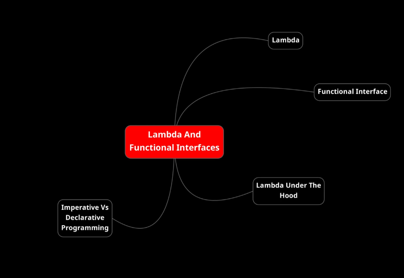
In this section of the course, we will understand the building blocks of functional programming: lambda and functional interfaces.  
**Lambda is a cute little algorithm and functional interface is the way to execute them.**

### Functional interfaces
Functional interfaces are important because we can't write lambda without them, they are behind every lambda.  
What is a functional interface? As its definition says: 
**functional interface can only have one abstract method so any interface that is having single abstract method is a functional interface**  
Annotating an interface with **@FunctionalInterface** is not necessary at all but is recommended for:
- give an evidence about the scope that interface
- prevents error like put more than one abstract method inside it.

The restriction to a Functional Interface to have a SINGLE ABSTRACT method because this is required to execute lambda without any ambiguity.

For example:
    
    // this a normal interface with two methods
    // is NOT a functional interface
    public interface MyInterface {
        void myMethod1();
        int myMethod2();
    }

    // if wi try to annotate it we'll obtain an error
    @FunctionalInterface
    public interface MyInterface {
        void myMethod1();
        int myMethod2();
    }

    // THIS IS A VALID Functional Interface
    public interface MyFunctionalInterface {
        void myMethod();
    }

    // THIS IS A VALID Functional Interface also annotated (that is always better)
    @FunctionalInterface
    public interface MyFunctionalInterface {
        void myMethod();
    }

After java 8 we can assume functions as they are variable assignments.  
For example:

    @FunctionalInterface
    public interface MyFunctionalInterface {
        void myMethod();
    }

    // we are asigning a function to a reference like we are used to do with normal variable
    MyFunctionalInterface myFunc = () -> System.out.println("Hello");

    // invoking the interface method we are going to execute the method implementation assigned bifore
    myFunc.myMethod();

Interesting right? More interesting is the capability to use lambda on the fly.

### Lambda on the fly
Take back the previous example:

#### Standard way
Previous seen standard way

    @FunctionalInterface
    public interface MyFunctionalInterface {
        void myMethod();
    }

    MyFunctionalInterface myFunc = () -> System.out.println("Hello");
    myFunc.myMethod();

#### On The Fly way
Now we are going to use the usage of lambda on the fly

    // we omitted the method visibility because depends on your code
    void onTheFly(MyFunctionalInterface func) {
        func.myMethod();
    }

    // we place here the code just as example, but you can put whenever you want in accordion with java rules
    // We are using on the fly a lambda
    onTheFly( () -> System.out.println("Hello On The fly") );

### Lambda are Smart
- Smart anonymous functions they use type inference
- Dynamic type language. Invoke dynamic functionality.  
Starting from Java 7, the compiled code is able to invoke "dynamically" some pieces of code.  
Allows dynamic language to bind symbols at runtime
- Also, reducing the length of the code, lambdas also help optimize the memory.

### Lambda Benefits
- Pass Behavior as parameter.   
We can pass behavior as parameters just like we pass data as parameters.
- Lambda enables declarative programming.  
The programmer says what to do rather than how to do. In this way a lot of things can be hidden.
- Using expressions instead of statement, and thanks the JVM capabilities, the code written using declarative style is thread safe and can actually work fine in multi-threaded environments.

**Note** Functional Programing is a **subset** of Declarative Programming 

### Lambda have
- List of Parameters
- An arrow "->" which separates the list of parameters from the body of the lambda function
- The body of the lambda

**Remember:** on the contrary a function have
- Access Modifier (public, private, etc...)
- Return Type
- Name of Function
- Parameters List and Parameters Type 
- Method Body
- Return Statement (if something returns) 

### Predefined Java Functional Interfaces
Java provide us set of predefined Functional Interface each one with its own scope.
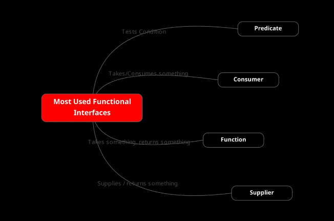
- **Predicate**: to test a condition. This is one of most used Functional Interface.
  - Accept input parameters
  - Return a boolean
  - The Predicate interface abstract method signature is: **boolean test(T var)**
- **Consumer**: to consume something
  - Accept input parameters
  - Return NOTHING
  - The Consumer interface abstract method signature is: **void accept(T var)**
- **Function**: to accept something and return a resul.  
This is one of most used Functional Interface and typically used for transformations.
  - Accept input parameters
  - return a result
  - The Function interface abstract method signature is: **R apply(T var)**
- **Supplier**: to supply a value
  - No input parameters
  - return a value
  - The Supplier interface abstract method signature is: **T get()**

Remember if a functional interface is having reusable signature we don't need to create different functional interfaces having same signature.
We can reuse it.

    @FunctionalInterface
    interface SimpleMathOperator {
        void operate(int a, int b);
    }

    SimpleMathOperator sum = (a, b) -> a + b;
    SimpleMathOperator multiply = (a, b) -> a * b;

On that basis java has already provided most general reusable signatures.  
These are added to **java.util.fun** package.  
So this function package that contains already defined generic functional interfaces.
In this provided list, you can see from left to right:
- The functional interface
- Its description where "T" and "R" are the generics
- The primitive specializations.  
These are used for primitive type: Int, Long and Double.  
When you have to works with primitive data, use its specialization because are more efficient avoiding the In/Out Boxing usage.

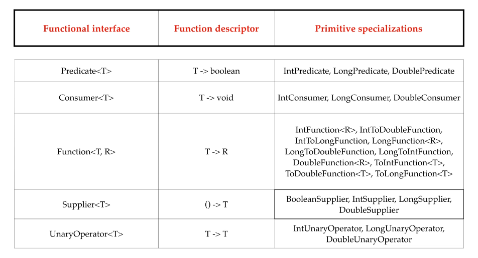

In this list we can see a first Functional Interface never met before: **UnaryOperator**  
The UnaryOperator<T> is an extension of Function<T,R> where T and R has same type.  
It represents an operation on a single operand that produces a result of the same type as its operand.  

The following list show us some other very useful Java Predefined Functional Interfaces.  
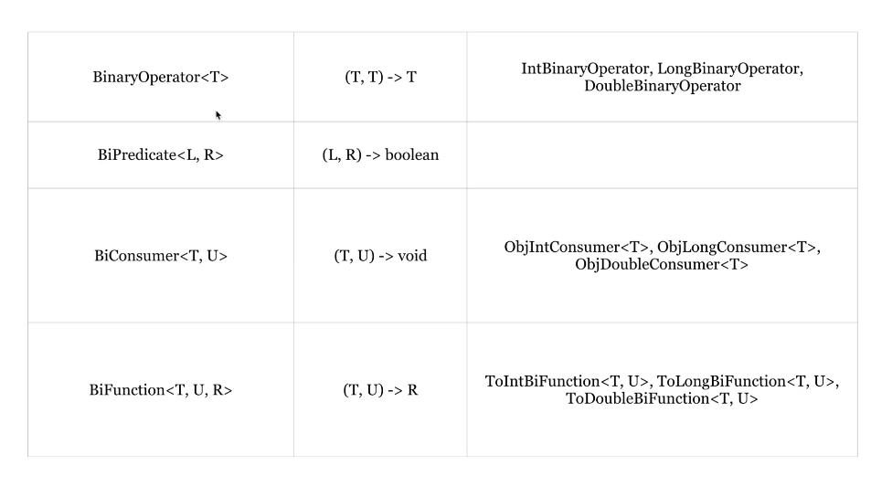
- BiFunction<T, U, R> accept two input parameters and return something.
- BiPredicate<T,R> accept two input parameters and return the boolean test result.
- BiConsumer<T,R> accept two input parameters and return nothing.
- BinaryOperator<T> is an extension of BiFunction<T, U, R> where all three types are all the same.

### Functional interfaces: Java Generic syntax
To understand functional interfaces from jdk library you should have a fair knowledge of java generics.  

This is NOT a Functional Generics Interface. **It's a normal Functional Interface** 

    @FunctionalInterface
    public interface FunctionalInterface {
        String execute(String s);
    }

This IS a Functional Generics Interface because we are providing it of Generics.

    @FunctionalInterface
    public interface FunctionalGenericInterface<T,R> {
        R execute(T t);
    }

Both T and R are simply to-uppercase letters used to indicate that we are using Java Generics.  
Which kind of letter you'll use is not a mandatory. Typically, these are what java library is used to use.
Let's take look to a couple of examples:

    FunctionalGenericInterface<String, String> fun1 = s -> s.substring(1,5);
    String substring = fun1.execute("Hello World"); // it will contains "Hello"

    FunctionalGenericInterface<String, Integer> fun2 = s -> s.length();
    Integer length = fun2.execute("Hello World"); // it will contains "11"

### Method | Constructor Reference
With functional interface we can pass the behavior on the fly using lambda, but we can also use method references at the places where we use lambda.  
We can also refer to already implemented method rather than writing the same behavior the implementation again.  

    // Look the FP01QuickOverviewReference example into section6 package

    // this is a lamda associated to a functional interface and used to test if a number is lower than 50 
    Predicate<Integer> myLambda = (b) -> b < 50;

    // this is a method that we can refers to and used to test if a number is even
    boolan myMethod(int b) {
        return a %2 == 0;
    }

    // for example, image to have a list od integers
    aListOfIntegers.stream()
        .filter(myLambda) // refering to functional interface
        .filter(i -> i >= 10 ) // lambda on the fly
        .filter(this::myMethod); // method reference

In other words, we can write a lambda or an algorithm matching an already existing method definition or behavior along with the number of parameters type and all.  
We can use this matching implementation at the place of the lambda, and it is called method reference.  
As we are directly referring to an existing method, and we also have constructor reference for object creation to directly refer to a constructor.

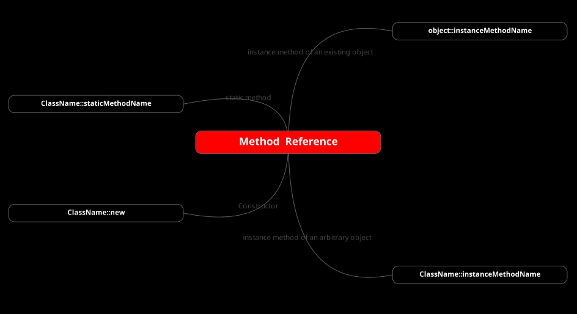

#### Method | Constructor reference syntax
In order to refer to a method or constructor we must use a couple of column after the name of class or the object reference.  
Also no input parameters must be set, are automatically inferred by the compiler checking the signature of method if compliant with what we are using.
Again we not need to set the typical lambda arrow.  
For example:
- we have a static method like "Math.random()", its method reference is Math::random.

        // Static Method Reference
        myDoubleStream.stream()
                .filter(...)
                .findFirst()

                // instead of ".orElse( () -> Math.random())
                //  - no lambda arrow set
                //  - no input parameters set
                .orElse(Math::random) 

- we may have an own method. In this case we will refer to this using this::random.

        // Our Methods
        double myMethod() {
            return 2.2;
        }
        
        double myMapMethod(double x) {
          return x * 2;
        }

        // Method Reference
        myDoubleStream.stream()
                .filter(...)

                // instead of ".orElse( () -> Math.random())
                //  - no lambda arrow set
                //  - no input parameters set
                .map(this::myMapMethod)

                .findFirst()

                // instead of ".orElse( () -> Math.random())
                //  - no lambda arrow set
                //  - no input parameters set
                .orElse(this::myMethod)

Actually we have 4 type of method reference
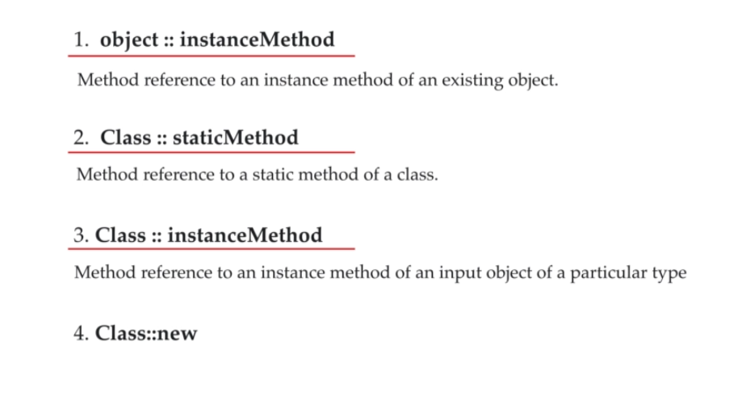

- **object::instanceMethod**: to an instance method of an existing object
- **Class::staticMethod**: to a static method of class
- **Class::instanceMethod**: to a method of a static instance of class.

  Like "System.out::println".  
  System dot out returns an object of print string. So it's an existing object, and we're referring to the instance method println on it.  
  Existing object is an object that we have created in code and is not an input parameter to the lambda.
  - "System" is the class name
  - "out" is a static class attribute of System class
  - "println" is a method of the class referred by "out" reference.  

  Look this other case: we are using the class name referencing to a method (it is not a static method).  
  

    // this function is referring to the String method "length".
    //
    // this is the source code of length method
    //
    //    public int length() {
    //      return this.value.length >> this.coder();
    //    }
    //
    // the signature of this method doesn't look respect the signature of Function<T,R>
    // it doesn't accept any input. How can it works?
    // It is able to work because we are referring to the String variable that expose this method.
    // The "length" method will be invoked on the argument supplied to this function. 
    // The method is applied on the object itself.
    // Length is applied on "s" that is not an input argument to the length
    //
    Function<String, Integer> strLenFunc = String::length;
    
    // this is the same of previous.
    Function<String, Integer> strLenFuncLambda = s -> s.length();

    final String str = "BasicStrong";
    final int strLen = strLenFunc.apply(str);
    System.out.println("The string ["+str+"] has a length of: "+strLen);

- **Class::new**: to refer to a default class constructor

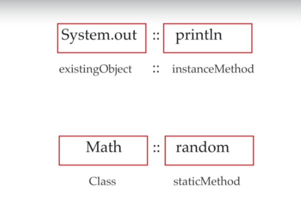

### Arbitrary input of Method Reference
An arbitrary object is the objects that are input to the lambda I am writing.  
Example:  
      
    Lambda : e -> System.out.println(e);
    Equivalent Method Reference : System.out :: println ;

Both are equivalent and both will need an input argument e at the time of execution.  
For example, if it's a Consumer:

    Consumer<Integer> c1 = e -> System.out.println(e);
    Consumer<Integer> c2 = System.out :: println ;
    c1.accept(2);
    c2.accept(2); 

Both c1 and c2 implementations are same, and they need an integer e at the time of execution.  
So, this e (which is 2 here) is the input or arbitrary object I am talking about.

### Optional
A null reference can be a ranger if not handled with care.  
Of a value or object is null any operation on that null reference causes null pointer exception and i would say it is the most occurred.  
Java sc8 introduced a new class called "Optional" (java.util.Optional<T>) that is inspired from ideas of Haskell and Scala.  
Take a look to "FP01DangerousNull" code in "section7" package to see in detail.  

#### Optional is
- a box which wraps a value in it
- it consumes 16 bytes
- it's a separate object so don't think no new object will be created when we wrap a value in an optional
- are immutable we can't change the value once they are created

**One thing is clear that creating optional everywhere can cost performance** because each time it creates a new object.  
So don't replace null with optional where you really don't need it

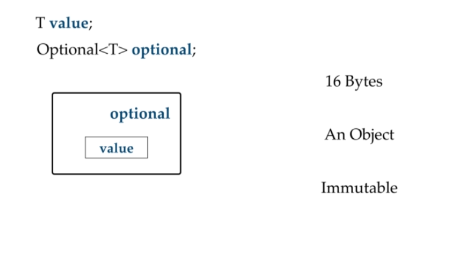

#### Set value on Optional
- Optional.of(....) when we have a value (NOT NULL) to set
- Optional.empty() when we have no data
- Optional.ofNullable(...) when we have a value to set, and we are not sure if it is null.

**Beware:**  Optional.of(null) will rise an exception.  
If always better use Optional.ofNullable(...)
- Optional.ofNullable(null) = Optional.empty()
- Optional.ofNullable("my value) = Optional.of("my value")

#### Retrieve value from Optional
- is would be better never use ".get()" because is a risky method.  
If we use it on "empty" optional object we'll obtain an exception.
- **orElse(other)** return the optional value if set, otherwise return the "other" value we provided
- **orElseGet(supplier)** return the optional value if set, otherwise return the "other" value supplied by the supplier
- **orElseThrow(Exception Supplier)** return the optional value if set, otherwise rise the exception supplied by the exception supplier

#### Optional operations - the most interesting methods
- **map (mapperFunction):** if the optional value is present map it to another value wrapped in an Optional and returned back
- **filter (predicate):** if the optional value is present it use the predicate to test the condition.  
If the condition is satisfied it returns the same option again otherwise returns an empty optional.
- **flatMap (mapperFunction):** is similar to map but the mapping function is one whose result is already an optional.  
FlatMap does not wrap the returned value of this mapper in an optional **because the value returned by this mapper is already an optional.**
- **ifPresent (consumer):** if the optional value is present ifPresent executes a consumer on that value
- **ifPresentOrElse (consumer, runnable):** if the optional value is present ifPresentOrElse executes a consumer on that value otherwise will execute the provided runnable
- **stream:** if the value is present it returns a sequential stream containing only that value otherwise it returns an empty stream.
- **or (supplier of optional):** it takes a supplier, and it returns the same optional if the optional has a value.  
If optional is empty then it's applying new optional returned by the supplier function.  
**Be careful** to do not return a null value from the supplier.
  If a value is present, returns an Optional describing the value, otherwise returns an Optional produced by the supplying function.
- **orElse (other):** If a value is present, returns the value, otherwise returns other
- **orElseGet (supplier of other):** If a value is present, returns the value, otherwise returns the result produced by the supplying function.
- **equals (object):** it's for checking some other object is equal to the optional or not. So what would be the criteria for that.  
The other object is considered equal if:
  - it is also an optional 
  - and either if both the optionals are empty
  - or both contains equal value
- **hashcode** method returns hash code value

### Functional Programming

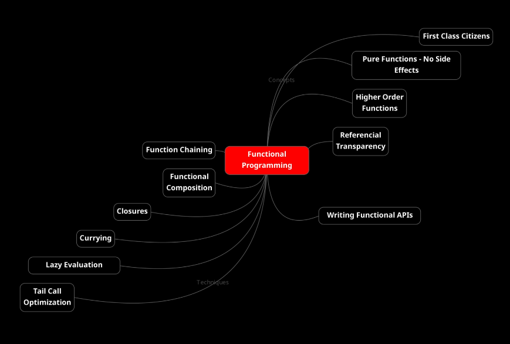

#### Key concepts
- **functions are first class citizens**  
In object-oriented programming with variables or with data we can do anything.  
We can pass them to any function we can get the result into them from any function.  
In functional programming, functions are first class citizen. A language that considers procedures or functions to be first class allows functions to be passed around just like any other value.  
This means the language supports passing functions as arguments to other functions.  
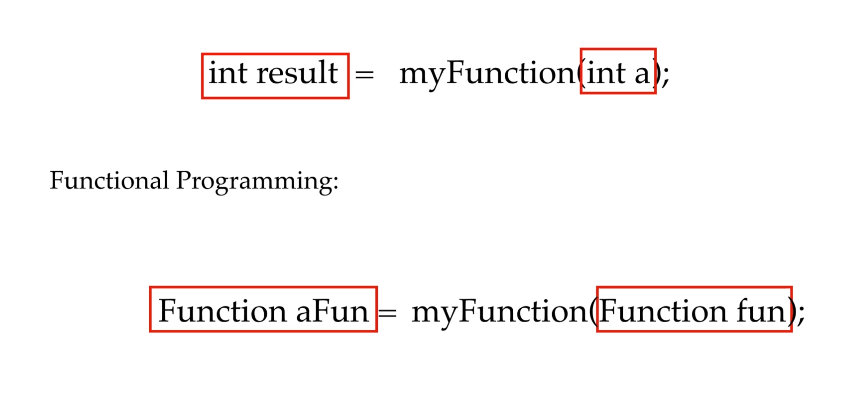  

- **pure functions**  
There are two characteristics that decides whether a function is a pure function or not.  
**When pure function has no side effects and is deterministic, only then it's a pure function!** 

  - A pure function depends only on its input parameters and its internal algorithm.  
    Hence if you call pure functions with the same set of parameters you will always get the same result.  
    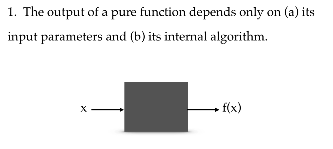
  - A pure function has no side effects. This means it does not read anything from outside world or write anything to outside world.  
    It does not read or write from: file, database, web, http calls and so on.
    It does not change the state of input object or other outside its context.
  - *A pure function always returns the same output for the same input.*
  - A pure function accept input and return something.
    **Note:** The **Consumer<T>** interface method is not a pure function.  
    Its signature method is:

        void accept(T t)

    As Java documentation says: **"the Consumer is expected to operate via side effects"**.  
    We can consider this like a special case if it will not hase particular side effects.  

The reason functional programming strives to work with pure functions because they allow:
- clarity of thought
- easy to reason about pure functions. Once we have defined we can consider them like black-box you can then use them as building blocks to compute operations of ascending complexity.
- they will never modify the shared state or variables. Pure Functions can be used fearlessly in multi-thread programs

#### *What a Pure Function should look like*
No data o object state will be modified by this function.  
It simply takes input, execute an algorithm and return a result. Nothing else!
Also for every same input it always return the same output. 

          public int sum(int a, int b) {
            return a+b;
          }

#### *THIS ABSOLUTELY NOT a Pure function*
In this case we haven't anything of Pure Function behaviours.  
The state of "var" changes, and it is outside of function context, also for evey invocation, given tha same input the output changes.  
This example has **side effects**

          int var = 0;

          public int add(int a) {
            var += a;
            return var;
          }

Look the "Demo" class in "section8" package to see another detailed example.

- **higher order functions**

#### Other important concepts
- no side effects
- referential transparency