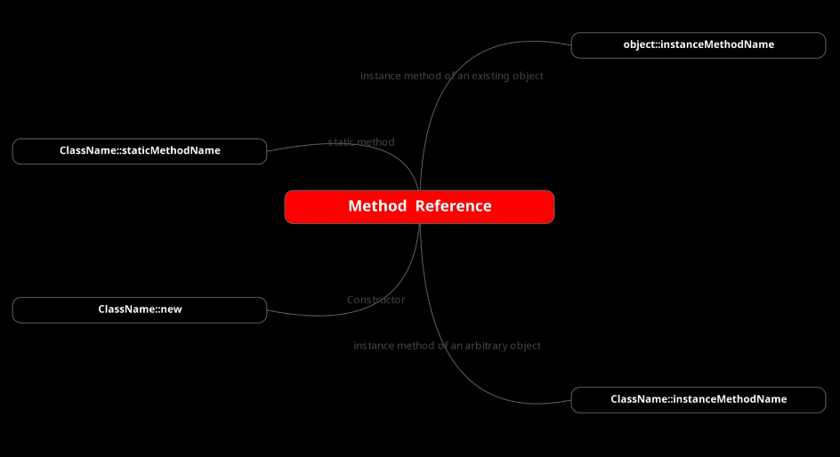

### Method | Constructor Reference
With functional interface we can pass the behavior on the fly using lambda, but we can also use method references at the places where we use lambda.  
We can also refer to already implemented method rather than writing the same behavior the implementation again.

    // Look the FP01QuickOverviewReference example into section6 package

    // this is a lamda associated to a functional interface and used to test if a number is lower than 50 
    Predicate<Integer> myLambda = (b) -> b < 50;

    // this is a method that we can refers to and used to test if a number is even
    boolan myMethod(int b) {
        return a %2 == 0;
    }

    // for example, image to have a list od integers
    aListOfIntegers.stream()
        .filter(myLambda) // refering to functional interface
        .filter(i -> i >= 10 ) // lambda on the fly
        .filter(this::myMethod); // method reference

In other words, we can write a lambda or an algorithm matching an already existing method definition or behavior along with the number of parameters type and all.  
We can use this matching implementation at the place of the lambda, and it is called method reference.  
As we are directly referring to an existing method, and we also have constructor reference for object creation to directly refer to a constructor.

#### Method | Constructor reference syntax
In order to refer to a method or constructor we must use a couple of column after the name of class or the object reference.  
Also no input parameters must be set, are automatically inferred by the compiler checking the signature of method if compliant with what we are using.
Again we not need to set the typical lambda arrow.  
For example:
- we have a static method like "Math.random()", its method reference is Math::random.

        // Static Method Reference
        myDoubleStream.stream()
                .filter(...)
                .findFirst()

                // instead of ".orElse( () -> Math.random())
                //  - no lambda arrow set
                //  - no input parameters set
                .orElse(Math::random) 

- we may have an own method. In this case we will refer to this using this::random.

        // Our Methods
        double myMethod() {
            return 2.2;
        }
        
        double myMapMethod(double x) {
          return x * 2;
        }

        // Method Reference
        myDoubleStream.stream()
                .filter(...)

                // instead of ".orElse( () -> Math.random())
                //  - no lambda arrow set
                //  - no input parameters set
                .map(this::myMapMethod)

                .findFirst()

                // instead of ".orElse( () -> Math.random())
                //  - no lambda arrow set
                //  - no input parameters set
                .orElse(this::myMethod)

Actually we have 4 type of method reference

- **object::instanceMethod**: to an instance method of an existing object
- **Class::staticMethod**: to a static method of class
- **Class::instanceMethod**: to a method of a static instance of class.

  Like "System.out::println".  
  System dot out returns an object of print string. So it's an existing object, and we're referring to the instance method println on it.  
  Existing object is an object that we have created in code and is not an input parameter to the lambda.
    - "System" is the class name
    - "out" is a static class attribute of System class
    - "println" is a method of the class referred by "out" reference.

  Look this other case: we are using the class name referencing to a method (it is not a static method).

    // this function is referring to the String method "length".
    //
    // this is the source code of length method
    //
    //    public int length() {
    //      return this.value.length >> this.coder();
    //    }
    //
    // the signature of this method doesn't look respect the signature of Function<T,R>
    // it doesn't accept any input. How can it works?
    // It is able to work because we are referring to the String variable that expose this method.
    // The "length" method will be invoked on the argument supplied to this function. 
    // The method is applied on the object itself.
    // Length is applied on "s" that is not an input argument to the length
    //
    Function<String, Integer> strLenFunc = String::length;
    
    // this is the same of previous.
    Function<String, Integer> strLenFuncLambda = s -> s.length();

    final String str = "BasicStrong";
    final int strLen = strLenFunc.apply(str);
    System.out.println("The string ["+str+"] has a length of: "+strLen);

- **Class::new**: to refer to a default class constructor

### Arbitrary input of Method Reference
An arbitrary object is the objects that are input to the lambda I am writing.  
Example:

    Lambda : e -> System.out.println(e);
    Equivalent Method Reference : System.out :: println ;

Both are equivalent and both will need an input argument e at the time of execution.  
For example, if it's a Consumer:

    Consumer<Integer> c1 = e -> System.out.println(e);
    Consumer<Integer> c2 = System.out :: println ;
    c1.accept(2);
    c2.accept(2); 

Both c1 and c2 implementations are same, and they need an integer e at the time of execution.  
So, this e (which is 2 here) is the input or arbitrary object I am talking about.