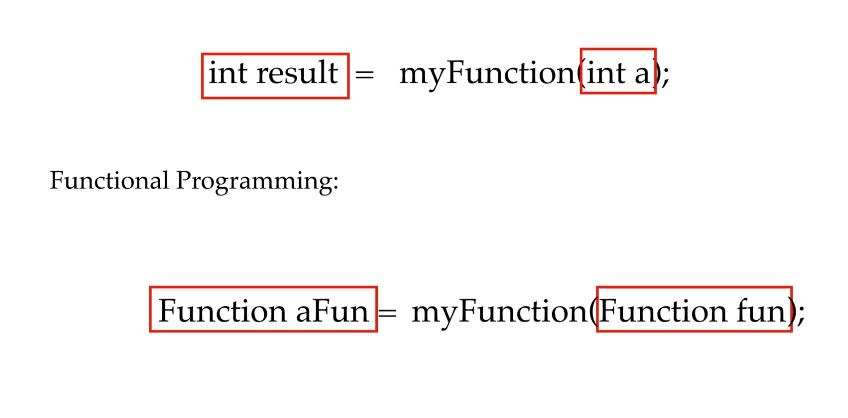
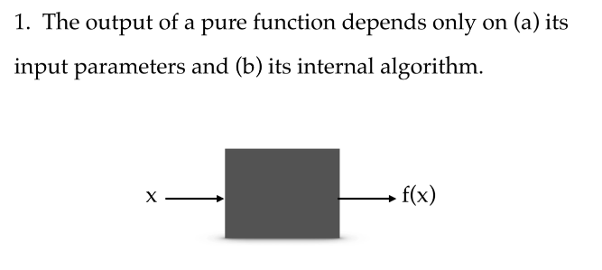

### Functional Programming

#### Key concepts
- **FUNCTIONS ARE FIRST CLASS CITIZENS**  
  In object-oriented programming with variables or with data we can do anything.  
  We can pass them to any function we can get the result into them from any function.  
  In functional programming, functions are first class citizen. A language that considers procedures or functions to be first class allows functions to be passed around just like any other value.  
  This means the language supports passing functions as arguments to other functions.  
  

- **PURE FUNCTIONS**  
  There are two characteristics that decides whether a function is a pure function or not.  
  **When pure function has no side effects and is deterministic, only then it's a pure function!**

    - A pure function depends only on its input parameters and its internal algorithm.  
      Hence if you call pure functions with the same set of parameters you will always get the same result.  
      
    - A pure function has no side effects. This means it does not read anything from outside world or write anything to outside world.  
      It does not read or write from: file, database, web, http calls and so on.
      It does not change the state of input object or other outside its context.
    - *A pure function always returns the same output for the same input.*
    - A pure function accept input and return something.
      **Note:** The **Consumer<T>** interface method is not a pure function.  
      Its signature method is:

          void accept(T t)

      As Java documentation says: **"the Consumer is expected to operate via side effects"**.  
      We can consider this like a special case if it will not hase particular side effects.

  The reason functional programming strives to work with pure functions because they allow:
    - clarity of thought
    - easy to reason about pure functions. Once we have defined we can consider them like black-box you can then use them as building blocks to compute operations of ascending complexity.
    - they will never modify the shared state or variables. Pure Functions can be used fearlessly in multi-thread programs

  #### *What a Pure Function should look like*
  No data o object state will be modified by this function.  
  It simply takes input, execute an algorithm and return a result. Nothing else!
  Also for every same input it always return the same output.

          public int sum(int a, int b) {
            return a+b;
          }

  #### *THIS ABSOLUTELY NOT a Pure function*
  In this case we haven't anything of Pure Function behaviours.  
  The state of "var" changes, and it is outside of function context, also for evey invocation, given tha same input the output changes.  
  This example has **side effects**

          int var = 0;

          public int add(int a) {
            var += a;
            return var;
          }

  Look the "Demo" class in "section8" package to see another detailed example.

- **HIGHER ORDER FUNCTIONS**  
  Are functions which either take functions as arguments or return them as output or does both.
  
  They are cornerstone of functional programming.  
  In java we implement functions using lambda. So we can say a higher order function is a function that takes one or more lambda expression as parameter or return a lambda expression or possibly does both.

#### Other important concepts
- **NO SIDE EFFECTS**  
  More detail in "pure function" section.  
  Briefly: a function has no side effect when the input is simply used in order to produce an output without exiting from its context.  
  No access to Database, files, logs etc. Also, it doesn't modify the state of the input parameters.  
  Nothing must be modified during its execution.

- **REFERENTIAL TRANSPARENCY**  
    
  Let's first understand referential transparency theoretically in an elegant way.

    - Take a sentence like: *"**tiger** is bigger than a kite"*
    - And now erase "tiger"
    - Now this is a context: *"**____** is bigger than a kite"*

  Filling the blank with another subject we should obtain a new sentence with complete meaning.
    - We could use "New Delhi". **Yes!** "New Delhi" indeed is bigger than a kite.
    - We could use "India's Capital". **Yes!** "India's Capital" indeed is bigger than a kite.
      Both subject substitutions are true.  
      **So truth and the meaning of sentence wasn't affected by our choice which of these two references we used.**  
      You should read **transparent as doesn't make a difference.**  
      Just like you can determine the result of applying the function only by looking at the values of its arguments.  
      In maths referential transparency is the property of expression that can be replaced by other expressions having the same value without changing the result.  
      For example these expressions are the same:
        - x = 7 + (2 * 4)
        - x = (2 * 4) + 7
        - x = 7 + (2 * 2 * 2)
        - x = 7 + (8)

      In functional programming the referential transparency means: **"That a function call can be replaced by its value or another referentially transparent call with the same result just like the math example."**
        - **"Pure Functions"** are always referential transparency. The opposite in not necessary true.
        - Functional style avoid such methods which are not referentially transparent.
        - Referential Transparency makes reasoning about programs easier.
        - It also makes each subprogram independent which greatly simplifies unit testing and refactoring.
        - Also, it is easier to read and understand