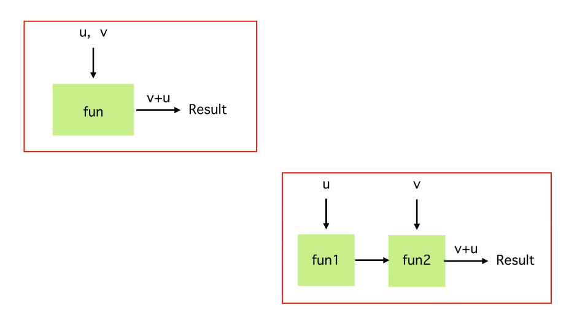

### Functional Programming Techniques
These techniques are very useful to write better functional code

#### Design APIs In Functional Way
From java 9 onwards we have default methods in interfaces and APIs take advantage of default methods to make both **"Function Chaining"** and **"Function Composition"** techniques possible in java.

#### Function Chaining
Function Chaining (aka Method Chaining) is a technique where each method returns an object allowing the calls to be chained together in a single statement without requiring variables to store the intermediate results.
Basically this technique is used to simplify the code when multiple functions are applied in a row.  
When we chain function, the first one get executed and then will get executed the second one on the result of the first one and so on.  
The chain will be triggered when we'll call the function abstract method.

        obj.func1().func2().func3()....funAbstractMethod()
        obj.performThis().andThenThis().andThenThis()....funAbstractMethod()

Will use the "default" interface method in order to do something like this:

        @FunctionalInterface
        interface MyInterface<T> {
            void doSome(T t);

            default MyInterface<T> theChainMethodName(MyInterface<T> next) {
                return (T t) -> {
                    // we refere here to the first called 
                    this.doSome(t);

                    // now we invoke the next one
                    next..doSome(t);
                }
            }
        }

**Important!!** That snippet is missing of one important thing: *"Fail Fast"*.  
Fail Fast is the capability to immediately fails if something is not configured correctly.
Look the example code "Technique01_Chaining" under "section8.techniques" package for more details.

#### Function Composition
The Composition essentially is the opposite of Chaining.  
When we compose two functions will get execute as first the last one and its returns passed to the previous one.

        a.compose(b)

#### Closures
Definition: A Closure is a function that refers to free variables in its lexical context.  
In this definition:
- the "function" is a block of code that may produce a result
- the "free variables" are identifiers used but not defined by the closure
- the "lexical context" (or lexical scope) is a convention that sets the scope of a variable may only be called from within the block of code in which it is defined.

In java when we pass a function to another we will have to deal with closures.  
For an example about this theme with more details, look the code: "Technique03_Closure" inside "section8.techniques" package

#### Currying
Currying is a technique which basically restructures a multi-parameter function into multiple functions having single parameter each.

For an example about this theme with more details, look the code: "Technique04_Currying" inside "section8.techniques" package

#### Lazy Evaluation
We already met many times during this course.  
When we write a lambda passing it to a reference we notice that this lambda is not executed until something triggers.  
Lazy evaluation is an evaluation strategy which delays the evaluation of an expression until the value is needed.  
We can take advantage of this behavior to delay or to even avoid method invocation or evaluation of an expression because some values might never be needed or some expressions are never needed to be evaluated depending on some conditions.  
It's also very useful to delaying the creation of heavyweight objects.  
Lazy evaluation basically says computing resources by avoiding unneeded computations.

#### Tail Call Optimization (aka TCO)