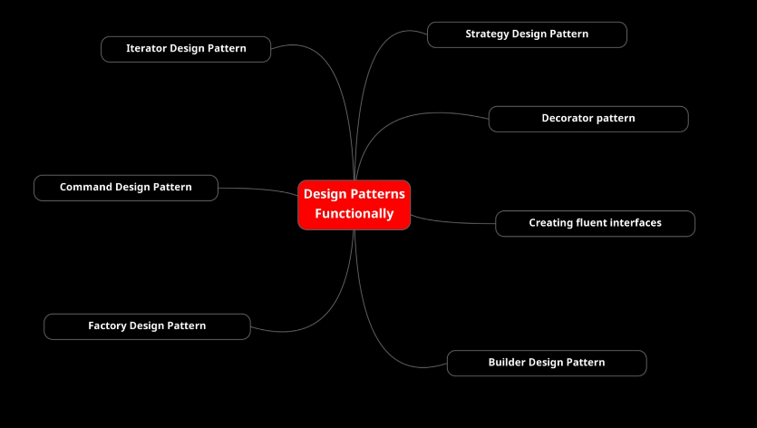
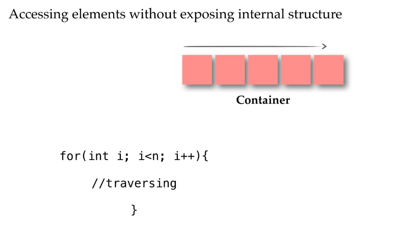
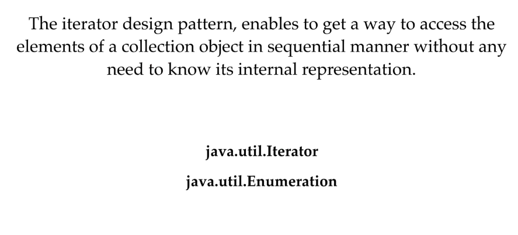
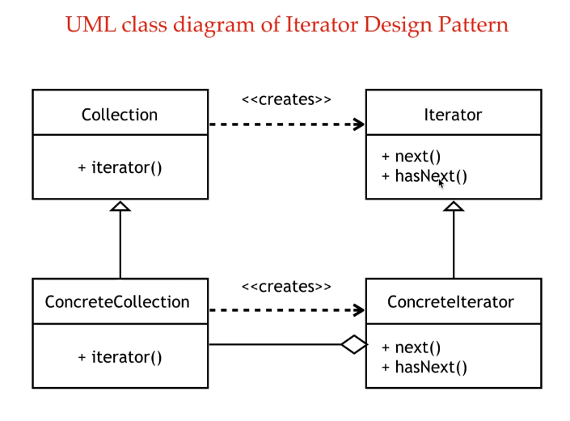
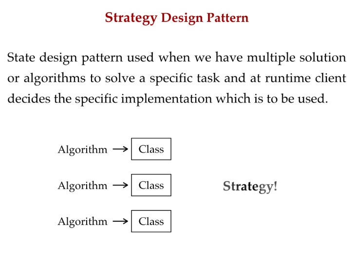
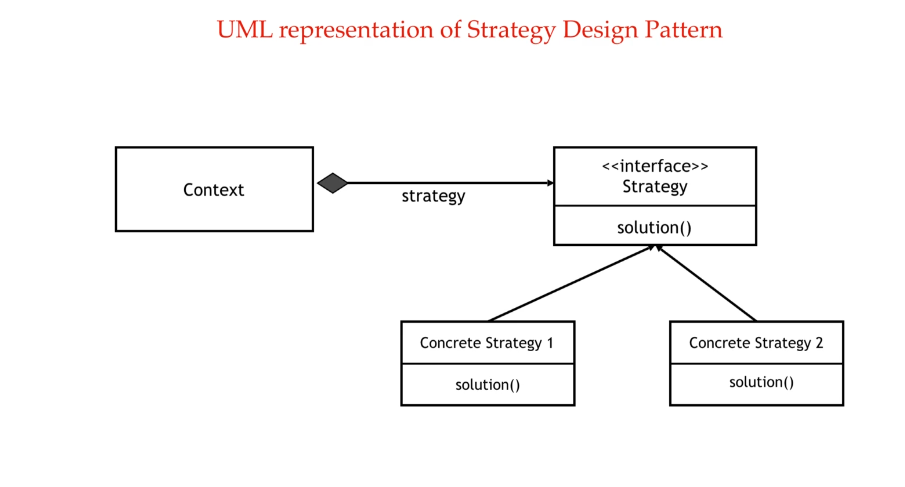

### Design Patterns

Look the examples into "section9.design_patterns" package.

- **Iterator Design Pattern** is about accessing the elements of a container without exposing the structure of the object.  
  For example to traverse any collection we used to use the conventional for loop in which with index we come to know everything about the structure of the object whereas with iterator we don't expose the internal representation of the object we are traversing.

- **Strategy Design Pattern**
  It's a behavioral pattern. This pattern is used when we have multiple solutions or algorithms for a specific task.
  
  
  This pattern can eliminate the conditional statements in the application, for example we may have multiple techniques to sort a collection and so choose which kind to use every time.  
  A perfect example is the "sort" method exposed by the "Collections" class of IDK itself.

      Collections.sort(List list, Comparator c)

  The client can specify the sorting strategy or the comparator implementation which is to be used at runtime.  