### Design Patterns

Look the examples into "section9.design_patterns" package.

- **Iterator Design Pattern** is about accessing the elements of a container without exposing the structure of the object.  
  For example to traverse any collection we used to use the conventional for loop in which with index we come to know everything about the structure of the object whereas with iterator we don't expose the internal representation of the object we are traversing.

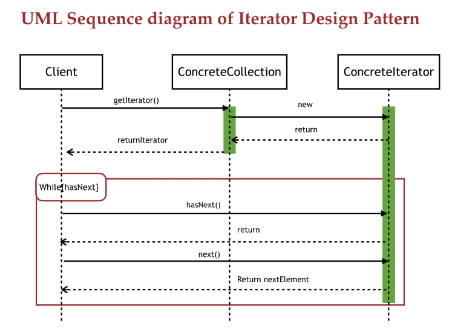
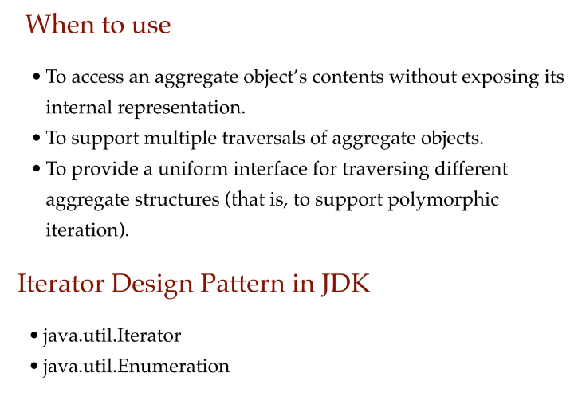

- **Strategy Design Pattern**
  It's a behavioral pattern. This pattern is used when we have multiple solutions or algorithms for a specific task.
  
  
  
  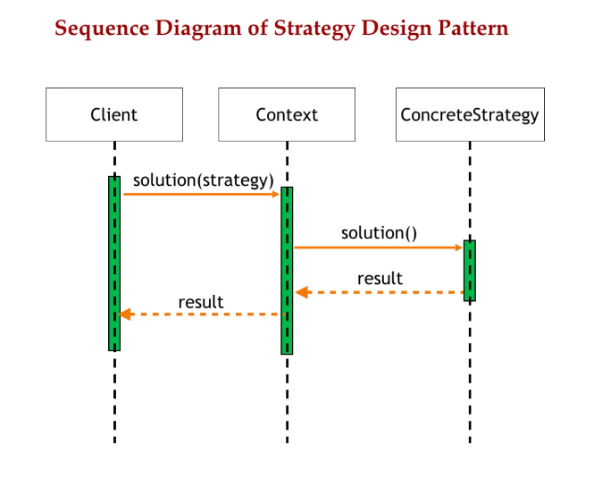
  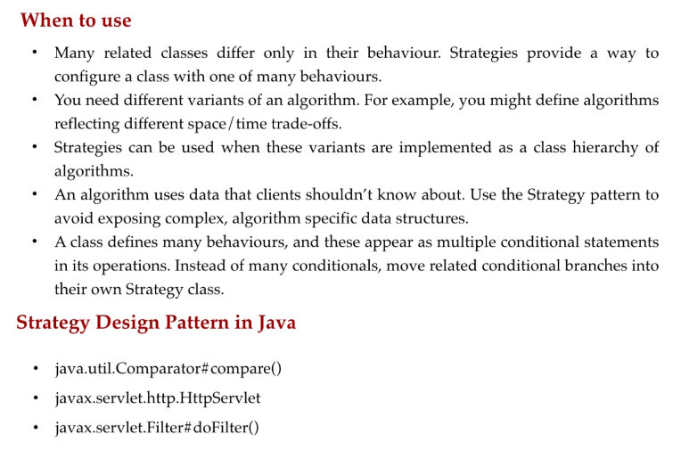
  This pattern can eliminate the conditional statements in the application, for example we may have multiple techniques to sort a collection and so choose which kind to use every time.  
  A perfect example is the "sort" method exposed by the "Collections" class of IDK itself.

      Collections.sort(List list, Comparator c)

  The client can specify the sorting strategy or the comparator implementation which is to be used at runtime.  

- **Decorator Design Pattern**
  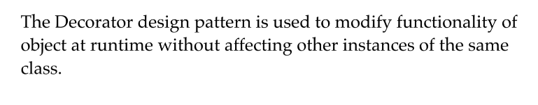
  What we basically have in this pattern we kind of have functionality wrappers, and we keep on wrapping the object into these wrappers one after the other according to the additional decorations or the additional functionalities that we want.  
  One point that should be of note here is that each new functionality demands a new class for itself so any new functionality coming in should be introduced in a new class.  
  We can also use **Inheritance** or **Composition** to modify the behavior of an object.  
  But the problem with this approach is that this is done at compile time we can't add any new functionality or remove any existing one at runtime so for this we have decorator pattern.  
  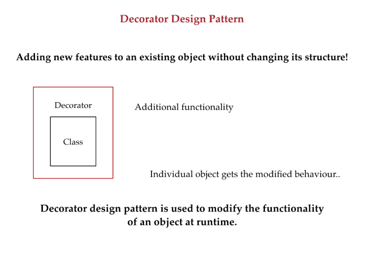
  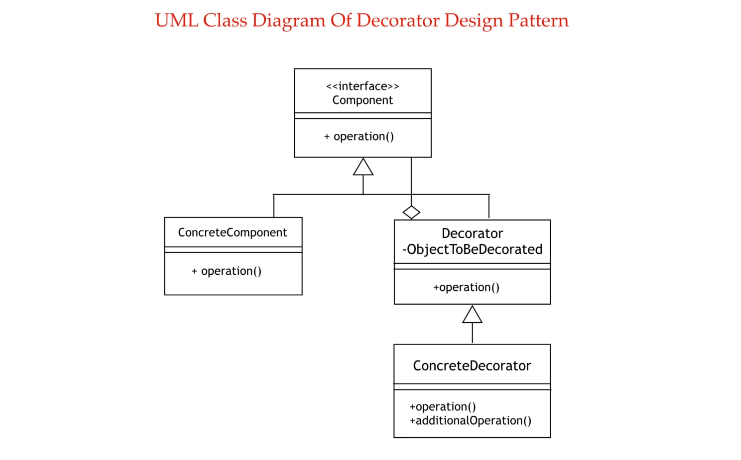
  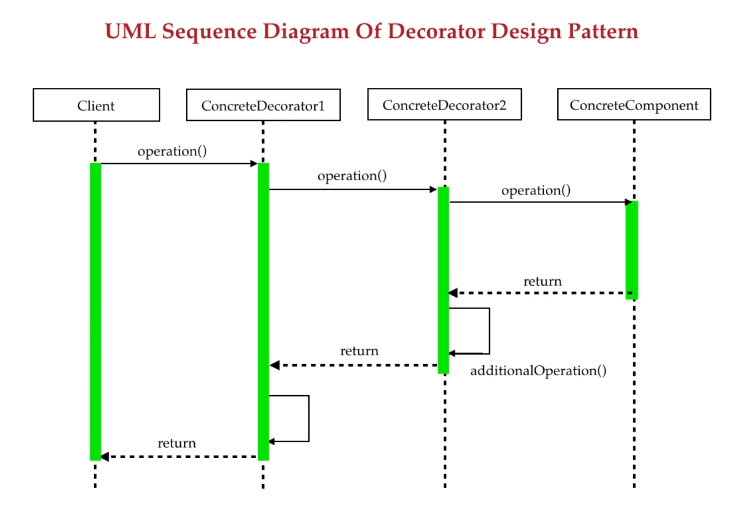
  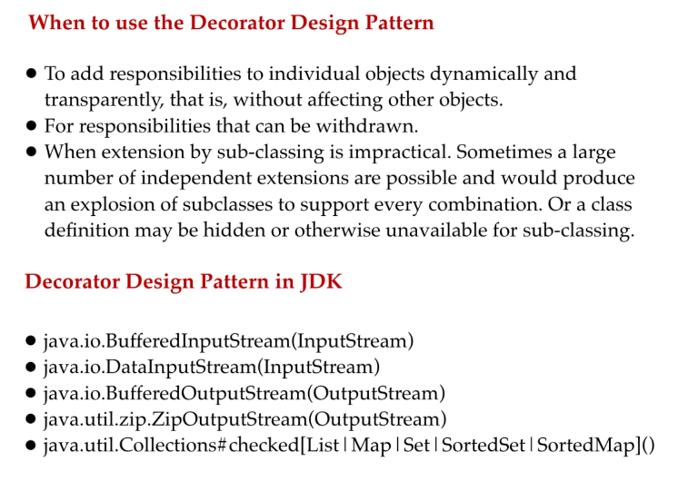

- **Fluent Interfaces**
  Is a way of implementation by which we get easy readable and flowing interface.  
  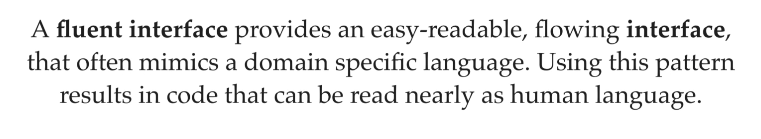
  Using this pattern code can get more readable nearly as human language.  
  This pattern is not from gang of four design patterns, but it's a very important pattern if we look to functional programming.
  An example of the usage of this concept is shown in "PatternDecorator" class into "section9.design_patterns" package.

- **Factory Design Pattern**
  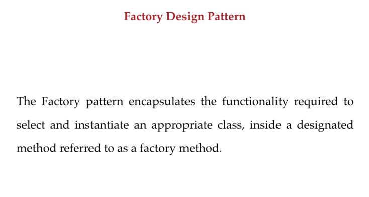
  Simply means we can create object without exposing the creation logic to the client.
  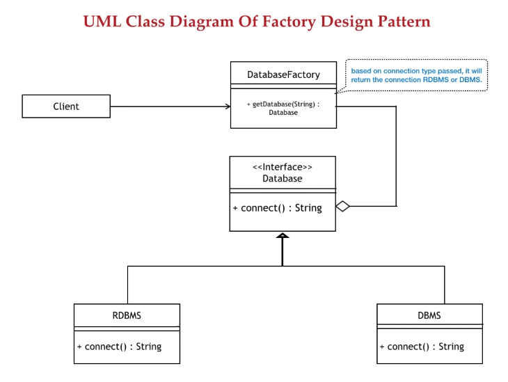
  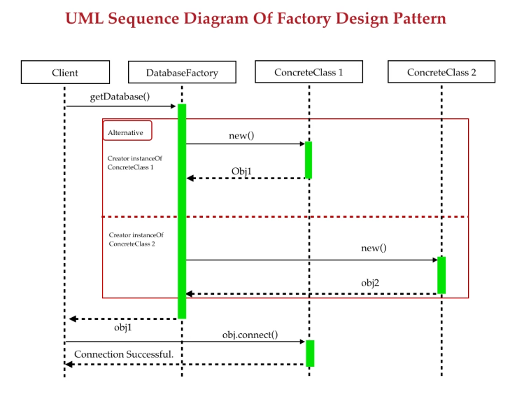
  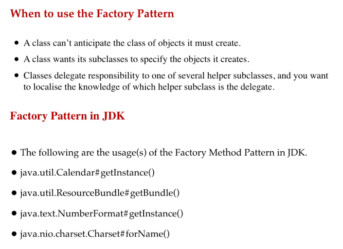

- **Factory Method Design Pattern**
  It is a creation pattern. Creation patterns are focused on how objects are created and the factory pattern is about creating objects without exposing the actual instantiation logic.  
  Client knows nothing about it even the type of the object that is going to be created is not known to the client.
  A typical JDK example is the Calendar.

      Calendar calendar = Calendar.getInstance();
  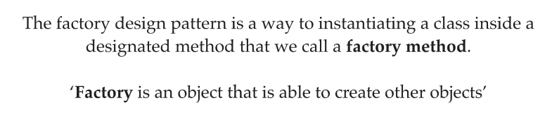
  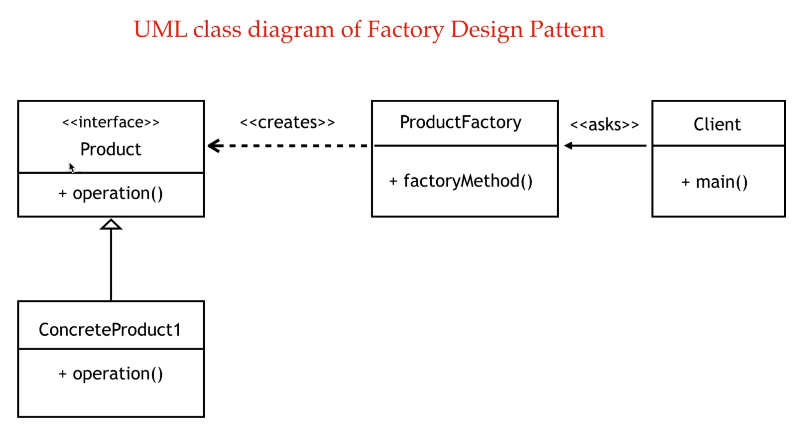

- **Builder Design Pattern**
  Builder pattern is all about providing flexibility in object creation.  
  It's a flexible solution to various complex object creation problems.  
  By complex we mean a lot of arguments to a constructor or a lot of setters, and we also ensure the immutability of the object after its creation.
  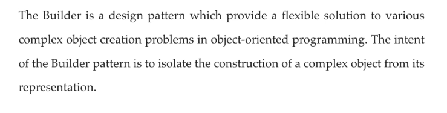
  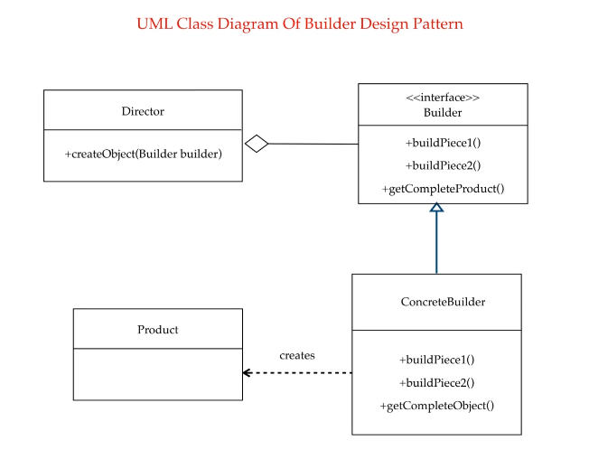
  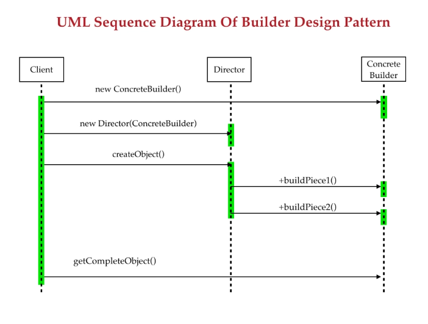
  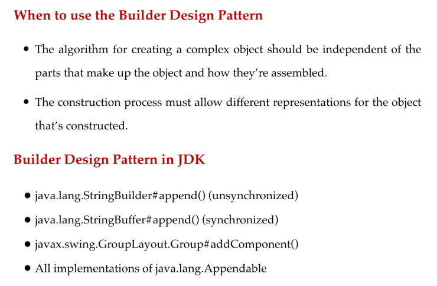

- **Command Design Pattern**
  Is a behavioral design pattern which is about encapsulating a request as an object.  
  In this pattern we write code that sequences and executes methods based on runtime decisions, or we can say commands.  
  For example all the implementations of runnable interface like creating thread by implementing runnable so each implementation that we give to runnable is a different command on which the methods of runnable gets executed.  
  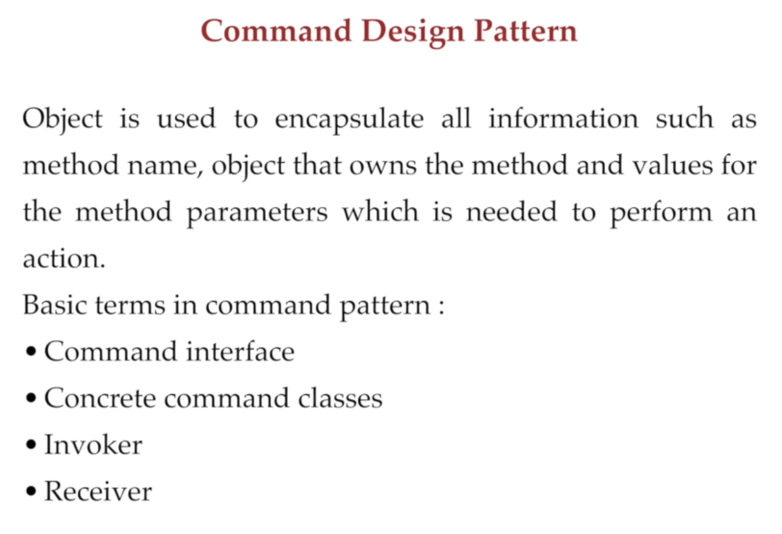
  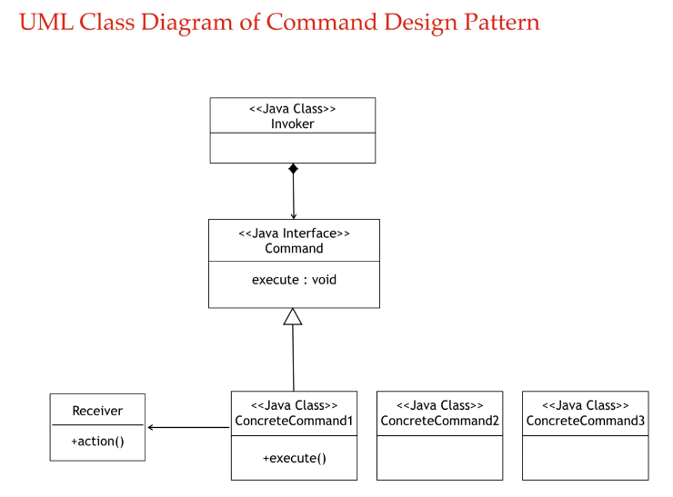
  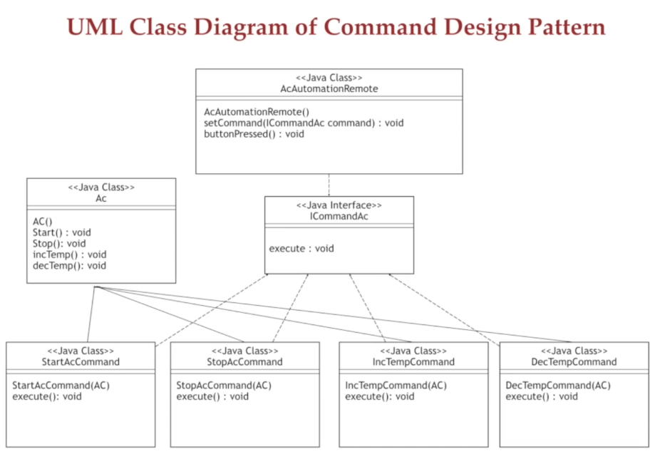
  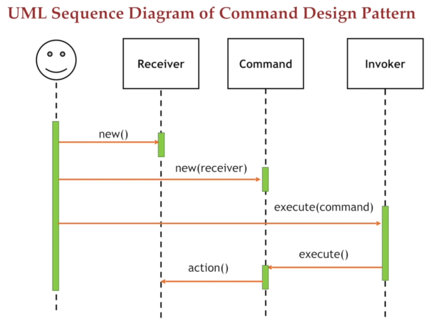
  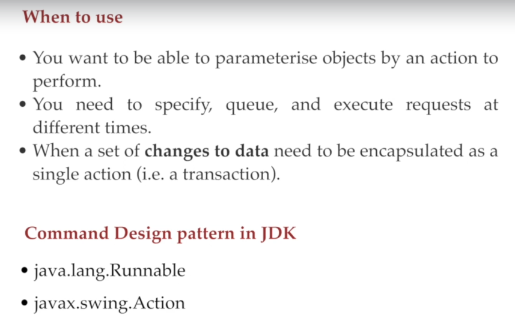