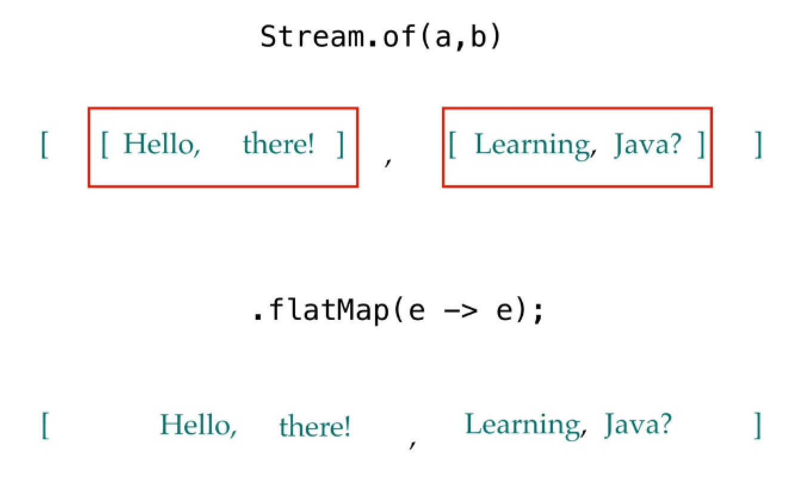

## Streams
We can use Streams in both functional and declarative style.

*Streams are not containers. Don't confuse it with List or more generally with a Collection.*  
It is a very advanced and fancy Iterator which does not contain any data.  
Streams expose a lot of methods (API), someone called Intermediate Operations, others called Terminal Operations.
Moth of Stream's methods (API) are Higher Order Functions, like:
- Filter
- Map
- Reduce

**Streams are lazy** and they are also:
- Declarative
- Concise and Readable
- Flexible
- Parallelize

### Streams Pipeline
A stream pipeline consists of:
- **Source** from which we generate the stream such as collection an array a generator function or an io channel.
- **Zero or more intermediate operations** these are operations that are applied on a stream, and they return another stream.
- **Terminal operation** produce a result or side effect from the stream.
  As we said a side effect is anything other than returning the result such as a print statement.

### Streams are not data Containers
Stream are immutables, once consumed you can not reuse it. We neither can add anything to an existing stream nor we can remove anything from it.   
If you try to reuse you'll obtain the error "stream has already been operated upon or closed".  
Streams are not collections, neither array nor other.  
Stream are more similar to an Iterator, very advanced and fancy, but like this one.  
Streams didn't contain data, Stream permit to iterate and applying operations over it during this data iteration and this is the stream pipeline.  
What we are able to perform on Stream is: read data, make an **operation that returns a new stream.**

### Streams are Lazy
As we already said, stream are lazy. We saw what terminal operations are we so what intermediate operations. We have already just encountered some of these.  
All the intermediate operations are lazy!  
Like a simple declaration, they will be executed only when the stream will be triggered against a terminal operation.  
Only the terminal operations are eager.

    // look this example
    Stream.of(1,2,3,4,5)
          // "peek" is used only to debug, peek the current value from the stream without consuming it
          .peek( n -> System.out.println("N before filter = "+n) )
          .filter( n -> n%2 == 0)
          // "peek" is used only to debug, peek the current value from the stream without consuming it
          .peek( n -> System.out.println("N before map= "+n) )
          .map(n -> ""+n);

    // if you try to execute this code, nothing happens because its only a declaration od the stream pipeline.
    // neither the filter, neither the map will be executed and also the "peek" function.
    //
    // if we would assign that code to a reference we should:
    Stream<String> stream = Stream.of(1,2,3,4,5)
          .peek( n -> System.out.println("N before filter = "+n) )
          .filter( n -> n%2 == 0)
          .peek( n -> System.out.println("N before map= "+n) )
          // map take an Integer a produce a String
          // this is why the final stream has "String" as type
          .map(n -> ""+n);

    // Now triggering the Stream using one of terminal operations like "reduce", "collect" and so on
    List<String> list = stream.toList();
    System.out.println(list);

    // in this case and only in this case the pipeline will be execute producing this output
    // N before filter = 1
    // N before filter = 2
    // N before map= 2
    // N before filter = 3
    // N before filter = 4
    // N before map= 4
    // N before filter = 5
    // [2, 4]

### Primitive Streams
Stream has some specialization for the primitive types: Integer, Long and Double.
This specialization is an optimization to prevent the Boxing/Unboxing the wast resources and performance.  
When you have to works with these kind of primitive type, use this kind of stream or the function provided by them.  
We have IntStream, LongStream  that are thought for treat primitive types.  
But also stream expose api like "mapToInt" and so on that give us the opportunity to pass from a generic type stream to a dedicate e more efficient stream.  
Look this code:

    // We are declaring a DoubleStream
    DoubleStream doubleStream = DoubleStream.of(2.2, 4.65, 11.0, 23.345);
    Stream<Double> streamOfDouble = Stream.of(2.2, 4.65, 11.0, 23.345);

    // now we print the references
    System.out.println("1 - The DoubleStream reference type is: "+doubleStream);
    System.out.println("2 - The Stream<Double> reference type is: "+streamOfDouble);

    // Pay attention to the type of streams printed
    // 1 - The DoubleStream reference type is: java.util.stream.DoublePipeline
    // 2 - The Stream<Double> reference type is: java.util.stream.ReferencePipeline

    // Now what happens if we do this?
    DoubleStream ds1 = streamOfDouble.mapToDouble(Double::valueOf);
    System.out.println("3 - The DoubleStream obtained from Stream<Double> reference type is: "+ds1);

    // We will obtain: a "ReferencePipeline" despite the code being back a "DoubleStream".
    // 3 - The DoubleStream obtained from Stream<Double> reference type is: java.util.stream.ReferencePipeline

    // Don't warry, the "ReferencePipeline" is the basic of all stream.
    // Try to test the instance reference
    ds1 instanceof DoubleStream
    // it return true
    
    // try the same with "streamOfDouble", you'll see an error. 

These kind of Stream expose in their API other useful functions like: average, min, max and so on.

From a Stream we can easily pass to a PrimitiveStream using the appropriated mapper.

In contrast, starting from a Primitive Stream we can obtain a Stream of object in two manner:
- Using the method "boxed()" that returns a Stream of same type of the Primitive Stream.  
  For example from an IntStream using the method "boxed()" we'll obtain a Stream<Integer>  
          
      Stream<Integer> intStream = IntStream.of(1,2,3).boxed();

- Using the method "mapToObject(DoubleFunction<T> mapper)" we are able to convert a Double to any arbitrary object we want.  
  For example:
    
      DoubleFunction<String> doubleToStringMapper = (d) -> ""+d;
      Stream<String> strStream = doubleStream.mapToObj( doubleToStringMapper );

### Primitive Streams Methods
As we said, the primitive streams extends the stream API with a lot of useful methods, thought to works with the numbers, like "average", "min", "max" and so on!
- **"sum()"** is a terminal operation that returns the sum of values present into the stream.  
  If the primitive stream is empty, it returns ZERO

      int    intSum = IntStream.of(1,2,3).sum(); // 6
      double doubleSum = DoubleStream.of(1.1, 2.2, 3.3).sum(); // 6.6
      long   emptyLongSum = LongStream.of().sum() // 0

- **"max()"** is a terminal operation that returns a primitive optional representation of maximum value present into the stream.  
  Why it returns an Optional? Because could have negative values and for this reason the maximum can not be zero and this function must return an optional of empty

      OptionalInt max = IntStream.of(3,1,7,9,3,5).max(); // OptionalInt[9]

- **"min()"** is a terminal operation that returns a primitive optional representation of minimum value present into the stream.  
  
      OptionalInt min = IntStream.of(3,1,7,9,3,5).min(); // OptionalInt[1]

- **"average()"** is a terminal operation that returns an optional double of the average value present into the stream. Note In this case will always get an OptionalDouble because we are calling an average.

      OptionalDouble average = IntStream.of(3, 1, 7, 9, 3, 5).average(); // OptionalDouble[4.666666666666667]

- **"summaryStatistics"** is very useful terminal operation to calculate: sum, average, min, max and count in one row.

      IntSummaryStatistics intSummaryStatistics = IntStream.of(3, 1, 7, 9, 3, 5).summaryStatistics();
      // IntSummaryStatistics{count=6, sum=28, min=1, average=4,666667, max=9}

### Streams API | Intermediate Operations | FILTER
A typical Intermediate Operations provided by the Stream API is the Filter.
Filter receive an item from the stream, apply the predicate logic we provided and if the predicate is satisfied it returns in a new Stream.
Filter is the functional equivalent of the "if" statement

    Stream<T> filter(Predicate<T> predicate);

Let's see an example!

    Predicate<Integer> evenPredicate = i -> i%2 == 0;

    List<Integer> listByLambdaPredicate = Stream.of(1,2,3,4,5,6,7,8,9,10)
          .filter( i -> i%2 == 0) // our lambda that implements the Predicate
          .toList();

    List<Integer> listByPredicateRef = Stream.of(1,2,3,4,5,6,7,8,9,10)
          .filter( evenPredicate) // our Predicate directly applyed
          .toList();

    // you'll see the same result.
    // 
    // Filter wants a Predicate<T>
    // A predicate accept a data, apply a logic and returns a boolean that indicate if test is passed or not
    //
    System.out.println(listByLambdaPredicate);
    // [2, 4, 6, 8, 10]
    System.out.println(listByPredicateRef);
    // [2, 4, 6, 8, 10]

### Streams API | Intermediate Operations | MAP
Another typical Intermediate Operations provided by the Stream is the map.  
Map use the functional interface Function<T,U> that which one take a value and return a new one.
It is another major used Stream method API. Very used to transform data from a type to another, to map a data against another and so on.
Again, every data returned by the "map" function will return as a new Stream.

#### **FUNDAMENTAL:** never change the state of the object received in input. Everytime returns a new one! Otherwise, we might get **concurrent modification exception** at runtime.
#### Moreover, we should try to avoid changing the state of an object when using functional programming

    <R> Stream<R> map(Function<T, R> mapper);

Let's see an example!

    Function<Integer, String> intToString = i -> "A String of "+i;

    List<String> listByLambdaPredicate = Stream.of(1,2,3,4,5,6,7,8,9,10)
          .map( i -> "A String of "+i) // our lambda that implements the Predicate
          .toList();

    List<String> listByPredicateRef = Stream.of(1,2,3,4,5,6,7,8,9,10)
          .map( intToString) // our Predicate directly applyed
          .toList();

    // you'll see the same result.
    // 
    // Map wants a Function<T,R>
    // A function accept a data, apply a logic and returns a result
    //
    System.out.println(listByLambdaPredicate);
    // [A String of 1, A String of 2, A String of 3, A String of 4, A String of 5, A String of 6, A String of 7, A String of 8, A String of 9, A String of 10]
    System.out.println(listByPredicateRef);
    // [A String of 1, A String of 2, A String of 3, A String of 4, A String of 5, A String of 6, A String of 7, A String of 8, A String of 9, A String of 10]

### Streams API | Intermediate Operations | REDUCE
Many times we need to perform operations where a stream reduces to single resultant value.  
*Reducing is the repeated process of combining all the elements.*  

Let's see the "reduce" API.  
- The first parameter "identity" is used to set the initial value and also identify the final result type. It has no effect during the accumulation operation.
- The second parameter "accumulator" is used to accumulate values during the final process. Remember the **Tail Call Optimization (aka TCO)** concept treated in "Functional Programming Techniques".

    T reduce(<T> identity, BinaryOperator accumulator)

Let's see an example!

    // Remember
    //
    // 1 - The BinaryOperator<T> is a BinaryFunction<T,U,R> where all the input and output have all the same type
    // 2 - An accumulator is based on TCO technique where every single iteration produce a result without waiting the previous. In this case.
    //      - first iteration  a = Identity Value,  b = first stream value       and return a + b
    //      - second iteration a = previous result, b = the second stream value  and return a + b
    //      - last condition return a
    BinaryOperator<Integer> accumulator = (a,b) -> a+b;

    Integer sum1 = Stream.of(1,2,3,4,5,6,7,8,9,10)
          .reduce(0, accumulator);
    System.out.println(sum1); // will print 55

    // now we are going to demostrate the usage of the "Identity" and how the accumulator works.
    Integer sum2 = Stream.of(1,2,3,4,5,6,7,8,9,10)
          // this is the equivalent code of the "accumulator" but for each iteration print the input parameters "a" and "b"
          .reduce(10, (a,b) -> {
              System.out.println("A = ["+a+"], B = ["+b+"]");
              return a+b;
          });
    System.out.println(sum2);

    // this is what will be produced into the console
    // A = [10], B = [1]
    // A = [11], B = [2]
    // A = [13], B = [3]
    // A = [16], B = [4]
    // A = [20], B = [5]
    // A = [25], B = [6]
    // A = [31], B = [7]
    // A = [38], B = [8]
    // A = [46], B = [9]
    // A = [55], B = [10]
    // 65

### Streams API | Intermediate Operations | FLATMAP
The FlatMap operation permit to combine two or more streams in a single stream.  
We can use it also to combine two or more collections.  
Take a look to "StreamFlatMap" into the "basics_strong.funcprogramming.section10" package for some examples.

### Bounded Streams
We can produce a bounded streams in several ways.

- **From a Collection:**

      Stream<Integer> streamOfInteger = List.of(1,2,3).stream();
      Stream<Integer> streamOfInteger = Set.of(1,2,3).stream();

- **From a Map:** Note! Since a map is made by a key-pair values we can not directly invoke the "stream" method.

      Map<Integer, String> map = Map.of(1, "One", 2, "Two", 3, "Three");
      
      // we are going to get a stream of map Key-Value entry
      Stream<Map.Entry<Integer, String>> entriesStream = map.entrySet().stream();
      // we are going to get a stream only made by the map keys
      Stream<Integer> keysStream = map.keySet().stream();
      // we are going to get a stream only made by the map values
      Stream<String> valuesStream = map.values().stream();

- **From an Array:**

      String [] strArray = {"One", "Two", "Three"};
      Stream<String> strStream = Arrays.stream(strArray);

      // a little note about the difference from when we use primitive and when we use their wrapper
      int [] intArray = {1,2,3,4};
      Integer [] integerArray = {1,2,3,4};

      // look the type of stream returned
      IntStream intStream = Arrays.stream(intArray);
      Stream<Integer> integerStream = Arrays.stream(integerArray);

- **Using the Stream static method "Of":**

      Stream<String> stream = Stream.of("One", "Two", "Three");

- **Using the Stream builder:** This very versatile because permit us to build a stream programmatically.

      Stream.Builder<String> strStreamBuilder = Stream.<String>builder();

      if( condition ) {
          strStreamBuilder.add("Red");
      } else {
          strStreamBuilder.add("Black");
      }

      Stream<String> builtStream = strStreamBuilder.build();

### Unbounded Streams (aka Infinite Streams)
Unlike the bounded stream where we have a length of it, with infinite stream we haven't this limit.  
In order to achieve this we have several ways.  
- **Iterate**
  The Stream class offer the static method "iterate" that wants a seed and a unary operator.  
  We can also have this capability using primitive Streams.

      - <T> Stream<T> iterate(final T seed, final UnaryOperator<T> f)
      - IntStream iterate(final int seed, final IntUnaryOperator f)
      - LongStream iterate(final long seed, final LongUnaryOperator f)
      - DoubleStream iterate(final double seed, final DoubleUnaryOperator f)

  The "seed" is the first initial value and define th type of data.
  The "UnaryOperator" at the first time use the seed as initial value and return a new value that will be used in the next iteration.  
  A little example:

      Stream.iterate(0, i -> i - 1)
            .limit(15) // is used to give a limit in this case.
            .forEach(System.out::println)

  

- **Generate**
  Another static method provided by the Stream class is "generate" that simply wants a supplier.  
  As the "iterate", this method is provided also by the primitive streams.

      - <T> Stream<T> generate(Supplier<? extends T> s)
      - IntStream generate(IntSupplier s)
      - LongStream generate(LongSupplier s)
      - DoubleStream generate(DoubleSupplier s)

  A little example:

      AtomicInteger intGen = new AtomicInteger(1);
      Stream.generate( () -> intGen.incrementAndGet() )
            .limit(15) // is used to give a limit in this case.
            .forEach(System.out::println)

### Parallel Streams
Modern computers are multicore processors so our programs can be designed in a way so that they can take advantage of multicore processing.  
This means more resources work simultaneously and streams can do that job.  
Is designed for the speed and easily provided us simply using "stream().parallel()" or "parallelStream()" on a collection or to a Stream.  

Deciding whether we should go parallel or not is not easy because going parallel is very expensive.  
Parallelism comes with some implications like outcome after the processing should be same as sequential processing.  
Applying parallel operation on some data we need to **keep in mind that the stream should be:**
- **stateless**
- **non-interfering** that is the data source should not get affected during the operation
- **associative** that is one operation result should not get affected by the order of data under processing  

Moreover, the parallel streams are built on top of fork join framework which is a multi-threaded framework so we should not have any synchronization or visibility issues.  
However these issues can be avoided easily if we are not changing the state of an object throughout the pipeline.  

#### **BEWARE to use the parallel.**
Parallel processing may be beneficial to fully utilize multiple cores.
But we also need to consider the overhead of managing:
- multiple threads
- memory locality
- splitting the source
- merging the results.

**ALSO! WE PAY ATTENTION TO UNDESIRED SIDE EFFECT.**  
Take a look to the example "FP14_BEWARE_TO_PARALLEL" and "FP14PerformanceParallelization" into "courses.in28min.funcprogramming" package.
Also! Take a look to the example "StreamParallelOperationPerfTest" into "basics_strong.funcprogramming.section10" package

### **Stateless and stateful operations**
- **Stateless operations** are performed one by one on the stream elements and *do not need any kind of outside information*
- **Stateful operation** is one which *uses outside information*

See the example "StatelessStatefulOp" into "basics_strong.funcprogramming.section10" package
This image refers to the example.

When we need to works with parallel stream we should avoid the usage of stateful intermediate operations.  
Always see the JavaDoc reference to check if the intermediate operations are stateful.
