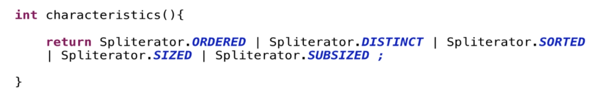

## Creating Streams from Custom Source and SplitIterator 
We already saw how to create Stream bounded and unbounded pre-provided by the JDK.  
Now we are going to see how to create our own Streams.

### Spliterator
What is spliterator why we use it?  
Spliterator is a special object on which a stream is built we use it to connect a stream on custom source. For example, we can use it to connect our Datasource to a Stream.  
Note that does not mean that spliterator is not used for other sources like collections, they already have their own implementations based on spliterator behind the scene.

Spliterator is an interface that we can implement to connect a stream to our custom source. *Basically it's an object to access the data which the stream can use!*

It has four abstract methods and some default methods.
- **tryAdvance** if a remaining element exists it performs the given action on it, and then it returns a boolean.  
  ***We never invoke this method, it will invoke by the Streams API.*** This is the heart method of Spliterator.  
  Typically, this is the hardest method to implements because contains our logic.  
  We need to perform: 
  - our logic to create our data
  - call the "accept" method to the provided consumer
  - return true or false if all is succeeded
- **trySplit** it splits the elements this is mainly useful in parallel processing. Some of the implementations of this methods in jdk is balance tree for high performance.  
  If we don't need to provide a Spliterator in parallel, simply leave null as return. 
- **estimateSize** it returns an estimate of number of elements that would be encountered by a "forEach" remaining traversal.  
  Return Long.MAX_VALUE to represents: infinite, unknown, or too expensive to compute.
- **characteristics** it returns a set of characteristics of the spliterator.  
  What are these characteristics? These are defined as constant into the Spliterator interface
  

### Spliterator Characteristics
Characteristics are used to define the state of history.

As we said, the spliterator expose the method "characteristics" which returns a set of these characteristics.

Let's take a look to these characteristics:

- **ORDERED** means that in stream generated on the spliterator the order matters. For example, the stream generated from ArrayList the order of elements is preserved.
- **DISTINCT** means there are no duplication in this Spliterator. The HasSet or Set collection are the perfect example.
- **SORTED** means that the stream is sorted.
- **SIZED** it says that size of Spliterator is known
- **NONNULL** it says that there can't be any null values present in the stream.
- **IMMUTABLE** it says that stream is immutable 
- **CONCURRENT** it says that stream is built on a concurrent structure, for example a ConcurrentHashMap.
- **SUBSIZED** is a bit like *SIZE*, but it signifies that all the split that are resulting from the *trySplit* method will be sized when we would go parallel.

For example the spliterator of the ArrayList returns these values:

    Spliterator.ORDERED | Spliterator.SIZED | Spliterator.SUBSIZED;

See "FirstLookCharacteristics" java example into "basics_strong.funcprogramming.section11" package.  

**Characteristics or state of stream, helps in performance optimization.**  
Suppose we have a sorted set, and we created the stream on the set followed by a sorted call.

    SortedSet<Integer> set = new TreeSet();

    set.stream()
       .sorted()
       .forEach(System.out::println);

How this pipeline will get executed?
1. The terminal operation is "forEach"
2. The "forEach" call, trigger the pipeline.
3. The first intermediate operation is "sorted", but the "SortedSet" is already sorted.  
   So when the pipeline get triggered and encounter the "sorted" method, in this case, since the "SortedSet" is already sorted, the "sorted" intermediate operation will not be executed.  
   Thus saving the time and effort!!
4. Only the last "forEach" will be executed.

Operations on stream can also modify the  stream characteristics.  
For example this sorted call sets the sorted characteristic but the set on which the stream is built was already sorted, so this sorted call preserved that characteristic.  
So operations may inject a characteristic may preserve a characteristic or may clear the characteristic which decides how the pipeline will be executed.

### Custom Spliterator
See the example "CustomSpliterator" on "basics_strong.funcprogramming.section11" package.