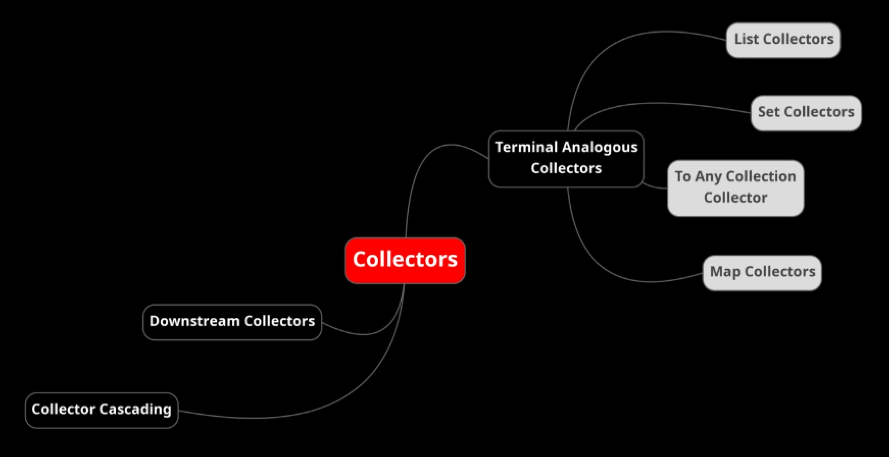

## Collectors for Data Processing in Depth 
Collectors make our life easiest if we have to process a lot of data in memory.  
In Java they are very useful to perform reducing operation like:
- accumulating elements into a collection
- summarizing elements according to various criteria
- ...and much more! accumulating and summarizing are the most used.

There are some collectors which are exactly analogous to terminal stream operations.  
We can call them terminal analogous collectors. We have:
- **list collector** to collect into a List
- **set collector** to collect into a Set
- **any collector** we have collection collector
- **map collector** to map

We also have the downstream collectors used for nest a collector inside one other. For example, starting from a list to produce a map with aggregated data.

### What are Collectors
When we trigger a stream pipeline using a terminal operation, all the  intermediate operation will get executed, and their result can be:
- consumed by the terminal operation "forEach"
- reduced to a single value by the terminal operation "reduce"
- collected to a new collection by the terminal operation "collect"

Java provide the utility class "java.util.stream.Collectors"  that provide ready-made reduction algorithms that can accumulate, summarize and aggregate elements into collection.  
We have different ready-made collector or methods to collect the data into various structures or into various containers.  
"Collectors" utility class is a final class that has all static method which provide the algorithm for the desired action and returns it as implementation of "Collector" interface.

### Important Collecting Operations - Collectors API
- **Collectors.toList() - Collectors.toUnmodifiableList()**  
    Both are used to collect the stream results to a single List.
- **Collectors.toSet() - Collectors.toUnmodifiableSet()**  
    Both are used to collect the stream results to a single Set.
- **Collectors.toMap(keyMapper, valueMapper) - Collectors.toUnmodifiableMap(keyMapper, valueMapper)**  
    Both are used to collect the stream results to a Map
- **Collectors.toCollection(Supplier collectionFactory)**  
    Used to collect a stream went from a collection to another kind.
    For example given a list we would like create a set or a tree-set or a liked-list in order to use the capabilities of this kind of collection.
- **Collectors.partitioningBy(Predicate test)**  
    This method is useful when we want partition our collection in TWO groups.  
    It returns a Collector of Map<Boolean, ?>
- **Collectors.groupingBy(......)**  
    This method is similar to partitionBy but, it is more versatile!
    It can take several arguments. 
  - The easiest is: **groupingBy(Function<T, K> classifier)**  
    It takes a function used as classifier and returns Collector of a map where the key is the classifier and value is the stream value.
  - Another useful is: **groupingBy(Function<T, K> classifier, Collector<T, A, D> downstream)**
    It takes a function used as classifier like the previous one but also accept another Collector used as downstream.  
    A typical is when we want group a data for a type and create a nested group by another classifier.  
    For example:

        // given a strem, we are going to collect grouping
        Map<Integer, Map<String, List<MyBean>>> map = stream.collect( 
                // grouping by
                Collectors.groupingBy(
                        // by age
                        i -> i.age(),
                        // an then grouping by name
                        Collectors.groupingBy(i -> i.name())
                )
        );

        // another example is collector mapping
        // given a strem, it collect
        Map<Integer, Map<String, List<Double>>> map = stream.collect( 
                // grouping by
                Collectors.groupingBy(
                        // by age
                        i -> i.age(),
                        // an then grouping
                        Collectors.groupingBy(
                                // by name
                                i -> i.name(),
                                // an then map the result
                                Collectors.mapping(
                                        // this is the mapper
                                        i -> i.salary(),
                                        // this is the collector of mapped results
                                        Collectors.toList()
                                )
                        )
                )
        );

