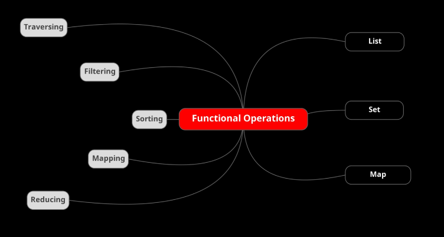

## Playing with Collections and Map in functional style
From Java 1.8many changes have been introduced thanks to the introduction of lambda functions.  
Collections util class was one of the biggest beneficiaries of these changes.

### java.util.List
The Java util List introduce some useful operation in functional way.

- **Traversal** concept is the equivalent of conventional "for" loop and exposed by the "forEach" List method.  
  Remember: Collection interface extends Iterable interface.
- **Sorting** List interface expose the default method "sort" used to sort a list that wants a comparator and returns nothing.
- **Filtering** is used to filter data. Neither List interface nor Collection interface directly expose a filtering method, we need to convert them in a Stream before.
- **Mapping** is used to map a data to another. Neither List interface nor Collection interface directly expose a mapping method, we need to convert them in a Stream before.
- **Reducing** is used to combine data or to aggregate data to single result. Neither List interface nor Collection interface directly expose a reducing method, we need to convert them in a Stream before.

### java.util.Set
The Java util Set is equivalent to the List but with main different thing: no duplicated data are permitted.  
When we use our beans we must override in them the "equals" and "hashCode" method in order to guarantee this behaviour.  
**Beware** Set has no a direct support to "sort", we need to convert it into a stream.

### java.util.Map
The Java util also has the exposed concepts looked on the List, but it differs from List and Set because each item is a couple of key-value, this means we need to operate on ist keys, or its values or on its EntrySet (a map value that contains both kay and value).  
**Beware** Map has no a direct support to "filter", we need to if we want to iterate the EntrySet, the key set or the value set and then convert it in stream. At this time we can filter data.