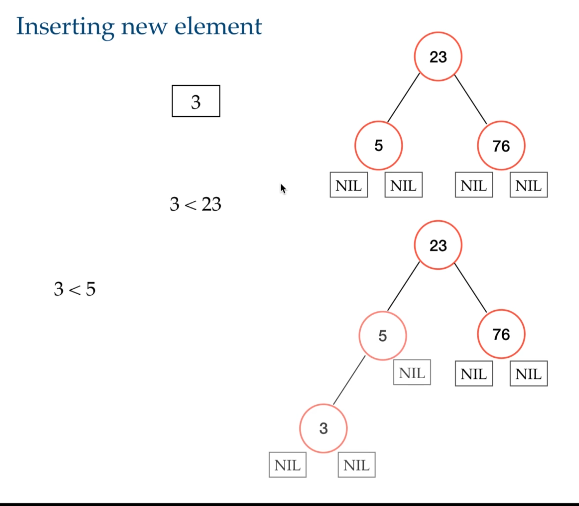

## Data Structures Functional Ways

We are used to use Data Structures like List, Queue, Stack, Tree etc.  
Also we are used to hear these are "Language Independent" but is true only in imperative scope.

Using imperative language data structures allow us to update or modify data at their place only.  
They share mutable state and many more things which makes them not much suitable for functional programming.  
Data Structures in functional ways is not so easy too because in functional programming we should avoid to change the state of data, we should return a new data always like pure functions would like.  

### Functional Data Structures | What and Why?
A functional data structure is something which is not imperative and yes implemented and functional way.  
In functional ways means no data modification or update, no imperative features, no side effects.

### Functional Data Structures | Properties, How they are different? (or even better!)
They are different and sometimes better from the regular implementations.  
A Functional data structure is always:
- Immutable
- Persistent
- Referential Transparency

### Functional Data Structures | Why it's so hard to implement?
- **No Destructive Updates** Functional Programming is strictly against destructive updates as they can be dangerous if not used correctly.
- **It has to be persistent** This is a hard work to functional data structures.  
  In imperative way we don't keep older or newer version of data and called ephemeral data structures. 
  In functional way we have to keep these versions, in both case we could implement this.
  Lot of imperative programmers find this data structures are more complicated, slower and less efficient than the ephemeral data because in functional way we always need to keep the previous state of that, *this is true but not always*. 

### Functional Data Structures | List
Keep in mind data must be immutables. Every time we add or update a list we need to create a new list

See ListDemo on "courses.basics_strong.funcprogramming.section15" package.

### Functional Data Structures | Queue

Since the traversing operation is expensive we are going to implements an optimization:

See QueueDemo on "courses.basics_strong.funcprogramming.section15" package.

### Functional Data Structures | Tree

It is very similar to our List implementation with main difference, now we ha a left and right.

See TreeDemo on "courses.basics_strong.funcprogramming.section15" package.

### Functional Data Structures | Map

See MapDemo on "courses.basics_strong.funcprogramming.section15" package.