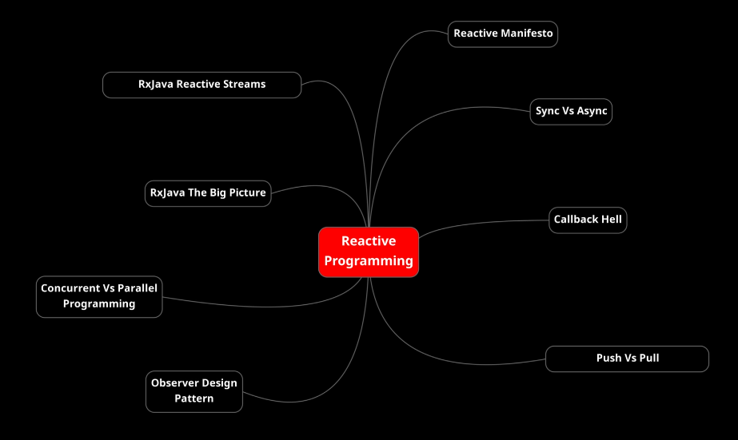
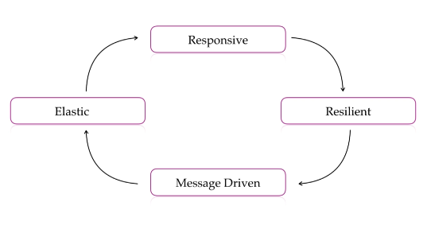
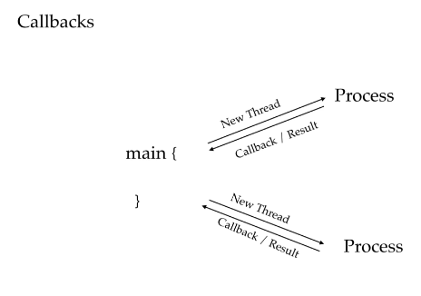

## Reactive Programming

### Introduction
Before the introduction of RXJava developers were not doing reactive programming.  
We are going to see what problem does it solve.  
Despite systems were ready to reactive programming, there wasn't standard, and it was hard to implements. RXJava offer a framework to implement achieve reactive programming in a more easy way relieve the programmers from the reactive programming details.   

### Reactive Manifesto
The meaning od Reactive in plain english **"is one who reacts"**.  
In modern programming, reactive programming is just like another paradigm of programming to add to others we already met: Procedural, Object-Oriented and Functional.  
We know ho to shift from Procedural to Object-Oriented and to functional taking the advantages of each paradigm and where these fit best to solve our problems.  
Each paradigm requires a shift of mindset to achieve it, Reactive Programming too. 
Reactive manifesto defines some of the rules for building modern systems.  
It says to meet modern demands and to exceed users expectations a system should be responsive it should be resilient it should be message-driven, and it should be elastic.

- **Reactive**: it means that there should be a upper limit of response time of an application, and an application should respond back to the user within a defined time limit.
- **Resilient**: in resilient systems errors are not second class. Just like the data, errors and failures are also first class citizens.
  So happy use cases and failures or errors are equally important in reactive systems, and you should deal with errors gracefully.
- **Elastic**: your system should be able to deal the increase of the serving requests without any manual intervention.
  In the world of cloud and distributed systems and microservices handling the situation is quite possible by doing very simple configurations.
- **Message-Driven**: is a mean by which systems can achieve loose coupling.
  The components of the system should talk to each other by asynchronous communication because this helps in building responsive systems because messaging is non-blocking.

### Sync vs Async
By definition asynchronous in computer programming refers to the occurrence of events independent of the main program flow and the ways to deal with such events.  
Asynchronous is achieved by concurrency in programming when you run your program in main thread and some other thread might be working in background for you and join the main program when done.  
To achieve this without RxJava you should implement CallBacks that are is easy to program but hard to manage when they increase.  
A CallBack is simultaneously running process having handle of the calling program which can be used later to pass the completion signal at later point of time when the process is complete.  

### The Hell of CallBack
CallBacks are fundamental concept to active asynchronous programming make the system responsive.  
Take a look to CallBackDemo on "courses.basics_strong.reactive.section16" package, you'll se are easy to write, but when the number of them increase is very hard to manage.  
As this is like a go-to statement and difficult to trace where the program pointer is during the execution.  
This is called a callback hell. RXJava solves this problem by working on observer design pattern.

### Push vs Pull
In general most loved programming model is request response model which is a pull based mechanism where a server sends back the response after processing the request.  
**In RXJava everything is push based** however we can achieve push mechanism from CallBacks but RXJava makes it very simple using **observables**.  
Take a look to CallBackPushDemo on "courses.basics_strong.reactive.section16" package.

### Observer Design Pattern

### Concurrency and Parallel Programming

### RxJava Big Picture

### RxJava Reactive Streams