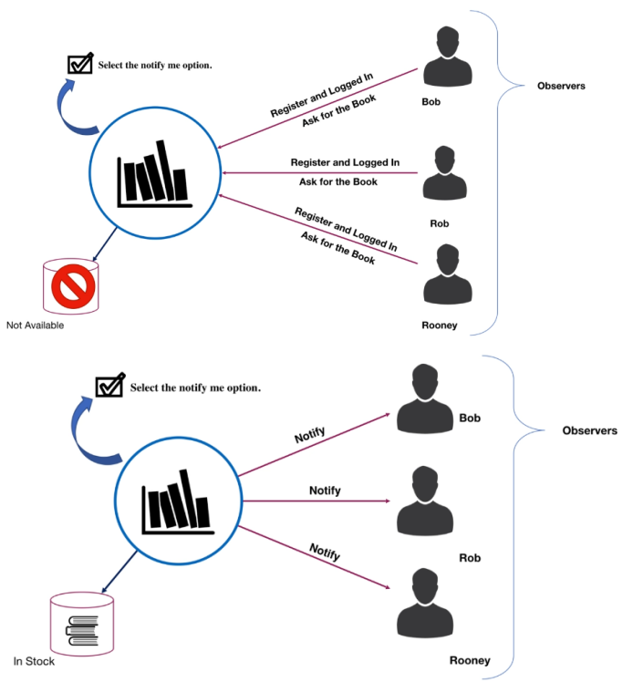
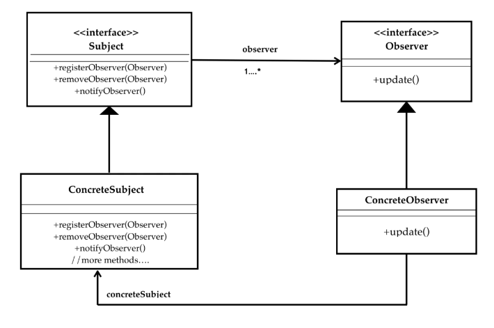
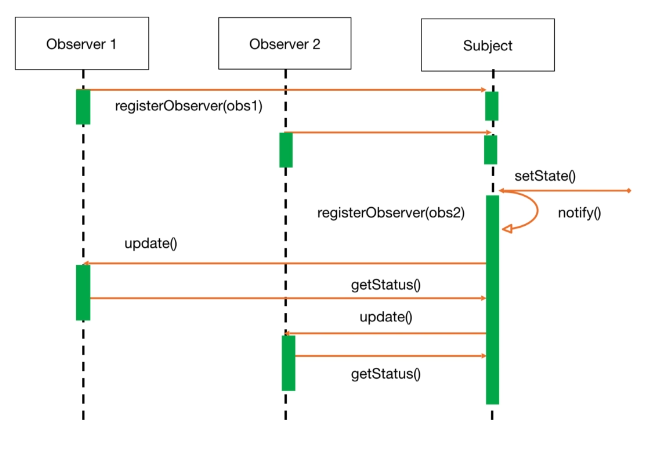
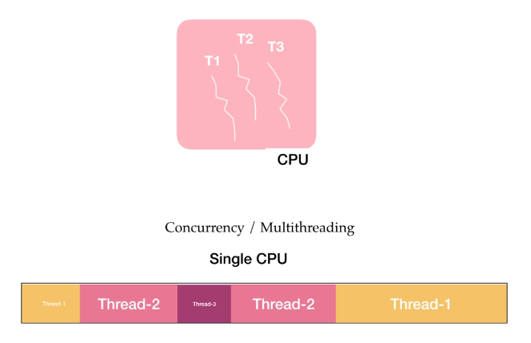
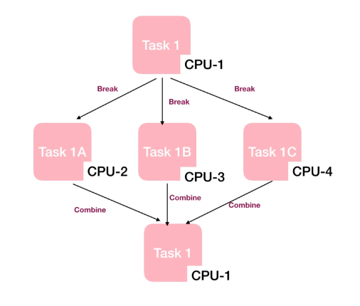
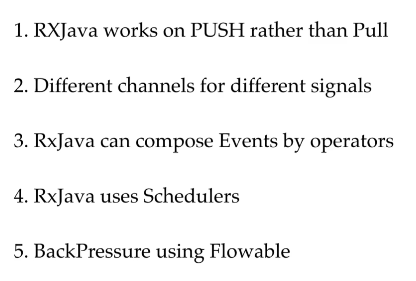

## Reactive Programming

### Introduction
Before the introduction of RXJava developers were not doing reactive programming.  
We are going to see what problem does it solve.  
Despite systems were ready to reactive programming, there wasn't standard, and it was hard to implements. RXJava offer a framework to implement achieve reactive programming in a more easy way relieve the programmers from the reactive programming details.   

### Reactive Manifesto
The meaning od Reactive in plain english **"is one who reacts"**.  
In modern programming, reactive programming is just like another paradigm of programming to add to others we already met: Procedural, Object-Oriented and Functional.  
We know ho to shift from Procedural to Object-Oriented and to functional taking the advantages of each paradigm and where these fit best to solve our problems.  
Each paradigm requires a shift of mindset to achieve it, Reactive Programming too. 
Reactive manifesto defines some of the rules for building modern systems.  
It says to meet modern demands and to exceed users expectations a system should be responsive it should be resilient it should be message-driven, and it should be elastic.

- **Reactive**: it means that there should be a upper limit of response time of an application, and an application should respond back to the user within a defined time limit.
- **Resilient**: in resilient systems errors are not second class. Just like the data, errors and failures are also first class citizens.
  So happy use cases and failures or errors are equally important in reactive systems, and you should deal with errors gracefully.
- **Elastic**: your system should be able to deal the increase of the serving requests without any manual intervention.
  In the world of cloud and distributed systems and microservices handling the situation is quite possible by doing very simple configurations.
- **Message-Driven**: is a mean by which systems can achieve loose coupling.
  The components of the system should talk to each other by asynchronous communication because this helps in building responsive systems because messaging is non-blocking.

### Sync vs Async
By definition asynchronous in computer programming refers to the occurrence of events independent of the main program flow and the ways to deal with such events.  
Asynchronous is achieved by concurrency in programming when you run your program in main thread and some other thread might be working in background for you and join the main program when done.  
To achieve this without RxJava you should implement CallBacks that are is easy to program but hard to manage when they increase.  
A CallBack is simultaneously running process having handle of the calling program which can be used later to pass the completion signal at later point of time when the process is complete.  

### The Hell of CallBack
CallBacks are fundamental concept to active asynchronous programming make the system responsive.  
Take a look to CallBackDemo on "courses.basics_strong.reactive.section16" package, you'll se are easy to write, but when the number of them increase is very hard to manage.  
As this is like a go-to statement and difficult to trace where the program pointer is during the execution.  
This is called a callback hell. RXJava solves this problem by working on observer design pattern.

### Push vs Pull
In general most loved programming model is request response model which is a pull based mechanism where a server sends back the response after processing the request.  
**In RXJava everything is push based** however we can achieve push mechanism from CallBacks but RXJava makes it very simple using **observables**.  
Take a look to CallBackPushDemo on "courses.basics_strong.reactive.section16" package.

### Observer Design Pattern
In this design pattern we have a Subject (aka Observable) which is responsible to maintain a list of all its dependent object known as Observers.  
Observer design pattern defines one too many dependencies between objects, when one object changes its state all of its dependent objects get notified or updated automatically.  

In RXJava when a Subject (aka Observable) state changes emits events or data.  
Whenever a Subject (aka Observable) is ready to emit the data or emits the data, the observer gets the data so this is how RXJava is using this pattern.  

Take a look to ObserverDesignPatternDemo on "courses.basics_strong.reactive.section16" package.

### Concurrency vs Parallel Programming
Concurrency and Parallel programming looks like very similar, but actually they are very different.  
- **Concurrency** is to run multiple parts of the program in single CPU by using different threads.  
  By doing concurrency we achieve responsiveness. CPUs can tune the threads internally by applying various algorithms like time slicing, and give every thread a chance to execute.  
  This is how single cpu is able to provide responsiveness.  
  So concurrency is when more than one task can start run and complete in overlapping time periods.  
  It doesn't necessarily mean they'll be running at the same instant, it's multitasking on a single core machine.
  
- **Parallel** is when tasks literally run at same time for example on a multicore processor.  
  The task gets split up to be processed by different cores or CPU.  
  After completion all the partial results are merged to get a single result or if all the tasks are independent then they simply run on different cpus and then completes.
  

In Java, we are able to create multiple thread to achieve multi-threading, and we can use "fork-join" pool for parallel programming but using javas core programming it's not easy to achieve these both.  
RXJava provides a better abstraction to achieve this. It provides us the schedulers and better support for concurrency and parallelism to make the life easier by doing heavy lifting under the hood.

### RxJava Big Picture
RXJava works on observer design pattern and:
- **Push** rather than pull.
  - It is push based, we can push the events to the observers different event like data error and complete signal.
  - This achieves asynchronous behavior easily as this is a kind of callback.
- **Different Channels** RXJava uses different channels for different signals like data channel on complete signal channel and error signal channel to make our application more resilient as the error is treated as a separate channel.
- **Operators** RXJava uses operators for processing and combining events.  
  Using operators we can achieve parallelism easily
- **Scheduler** to support parallel programming RXJava uses a different kind to schedulers like IO intensive computation-intensive.  
  It does all the heavy lifting of parallel programming and enable us to focus on our business logic.
- **BackPressure** RXJava is backpressure ready to control producer-consumer problem.  
  If producer is producing at high speed so that consumer is not able to consume all the items at that speed or vice versa, RXJava can handle that condition using backpressure techniques.

### RxJava Reactive Streams
RXJava is library made by Netflix and on time we are writing we will see the 3.x version.  
Reactive Streams are set of interfaces and Java says that if the API implements these interfaces and the TCK (Technology Compatibility Kit) which is reactive stream's technology the API becomes compatible and reactive.  
*This API uses flowable instead of observables.*   
RXJava was there even before reactive stream specifications came it uses observable, but it also implemented flowable to make itself interoperable.  
*Java 9 also implements TCK, and it's having flowable api for reactive programming.*  
There are many reactive APIs available, for example you can use reactor core as well so you can use any implementation of TCK that you like.  
**Note that only difference** between flowable and RXJava's very own observable is that flowable is back pressure ready and observable is not but RXJava also.