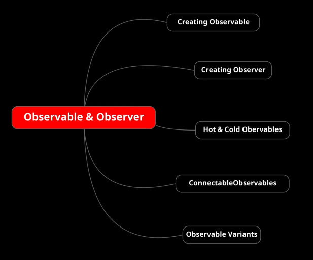
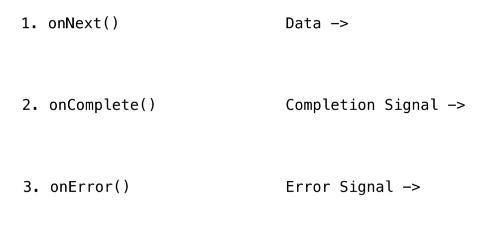

## RxJava | Observer - Observable

### Observable-Observer
If you think a bit to how the Observable works you'll notice that it is quite similar to Iterator with a main different: whereas the Iterator pulls the data from the source, the Observable push them towards the observers.  
RxJava works very similar to Stream with intermediate and terminal operations, so this means also Observable is lazy: it does nothing until it is subscribed.  
To once the observer gets subscribed it start executing the pipeline on the element emitted by the observable.  

    // Java Stream
    stream
      // intermediate operation
      .map(v -> "Mapping value "+v+" in order to transform it to string")
      // terminal operation
      .forEach(System.out::println)

    // RxJava
    observable
      // intermediate operation
      .map(v -> "Mapping value "+v+" in order to transform it to string")
      // terminal operation
      .subscribe(System.out::println)

Take a look to how Observable works. This is the Observable interface:

    interface ObservableSource<T> {
      void subscribe(Observer<T> observer);
    }

1. The Observer invokes the subscribe method to subscribe to an observable.
2. After subscribing to an observable the observer basically passes three types of events:
   1. **onNext(T value)** the source observable passes each item one at a time to the observer using this method
   2. **onComplete()** this tells that no more or next calls will occur.  
      The emission of elements or the events is now complete.
   3. **onError(Throwable error)** in reactive programming errors are just treated like data.  
      The data flows from observable to observer or through the complete pipeline errors also gets propagated.  
      *They are also first class citizens.* If we get any error or any event that's get here in "onError" to be handled.  
      The observable pipeline terminates here on "onError" and no more emissions will occur, just like "onComplete" but if we get encountered by an error and "onError" method is invoked and "onComplete" will never execute.

We can figure this three method like three channels.   

Now take a look to how Observer interface:

    interface Observer<T> {
       void onSubscribe(Disposable d);
   
       void onNext(T t);
   
       void onError(Throwable e);
   
       void onComplete();
   }

We had already discussed that method except the "onSubscribe" method.  
**onSubscribe** this method is called once when an observer subscribes to an observable.  

See th ObservableAndObserver java class in "courses.basics_strong.reactive.section17" package.

### Crating Observable
On the examples "ObservableAndObserver" and "HelloRxJava" we have created on "Observable" using its factory method "Observable.create(...)", but there are various ways to create an observable.  
1. **create(...)** we already met this one, it is rarely used preferring the "just" method.  
   This method need a lambda where we have to invoke manually: onNext, onComplete and onError.
2. **just(T value)** it take one or more values to push, maximum 10 values. The onNext, onComplete and onError will be implicitly done by this.
3. **fromIterable(Iterable<T> iterable)** like "just" method did, this is used to push value directly but taking it from an Iterable. We don't care about to handle the "onXXX" methods.  
   Note: there are few methods like this one with same concept: "fromArray", "fromCollection", "fromStream", "fromSupplier", "fromFuture" and many others.
4. **range(int starValue, int totalCount)** it range based emission so it takes start value and the total count, we also have its long equivalent **rangeLong**.
5. **interval(....)** exists different variants of this method. we can pass an initial delay or not, we can pass a custom scheduler, but all these variants wants a period and a TimeUnit.  
   NOTE: all these variants returns a Long.
   These methods are designed to send an event every period of a certain time unit.  
   *They continue to emit values until the subscription won't dispose.  
   These variants are time based and need to work on separated thread.* 
6. **intervalRange(...)** is very similar to "interval" and works similar to them. Despite the "interval" these variants:
   1. always wants a "starValue" and a "totalCount"
   2. when the count ends, automatically send the "onComplete" event.
7. **fromFuture(Future<T> future)** PAY ATTENTION to use it, is not easy to use.
8. **empty()** if we want to create an empty observer we invoke the empty method.   
   It will emit nothing it will just call the on complete action.
9. **never()** it also emits nothing, and it also never calls "onComplete" action. This observable is used for testing to prove that no emissions are coming from it.
10. **error(ExSupplier exSup)** needs of an Observer able to handle the "onError" event. This is used to rise errors.
11. **defer(Supplier<ObservableSource> observableSupplier)** it creates a separate state for each observer. Useful when for example we wants observes a list that can change.
12. **fromCallable(Callable)** similar to "fromFuture" with also the same recommendations.

### Crating Observer

### Hot and Cold Observables

### Connectable Observable

### Observable Variants

### Dispose