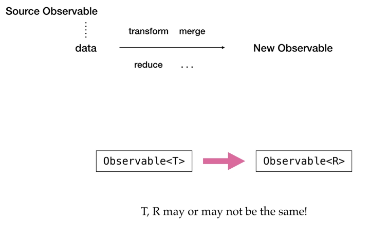
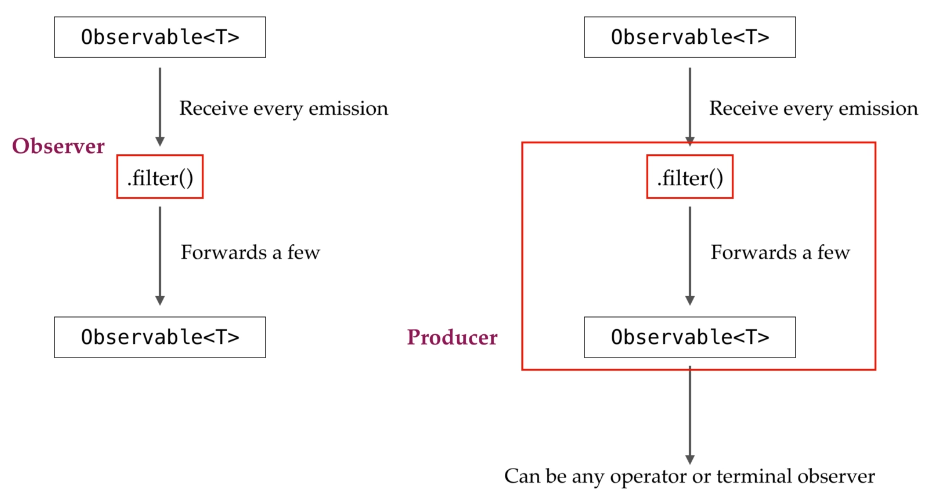
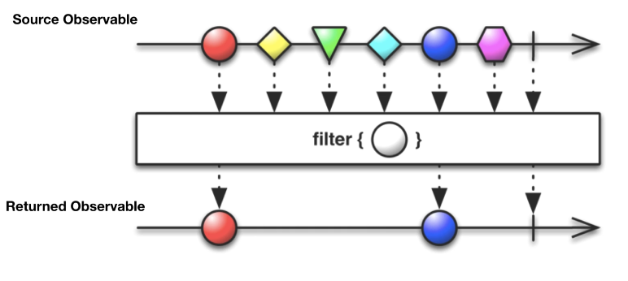
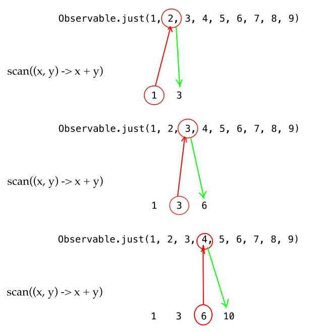
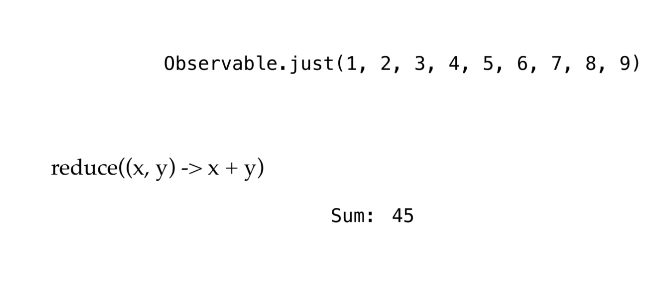
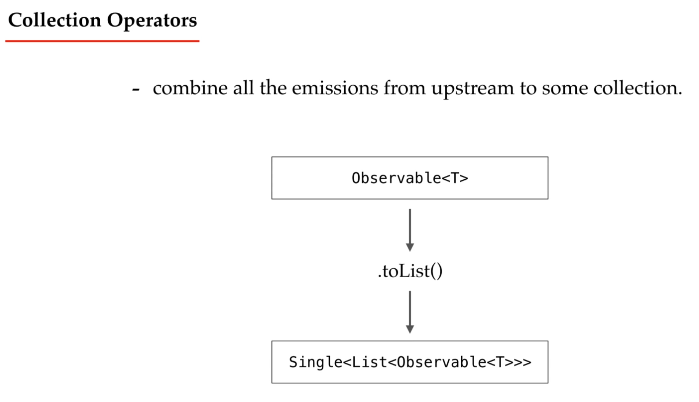

## RxJava | Operators

### What are Operators?
Basically, operators are something which allow us to transform modify merge reduce data emitted by the source and return a new observable with transformed data.  
We can say operator is a function that takes upstream Observable< T > and returns a downstream Observable<R>.

For example the "filter" operator will receive every element from the upstream observable, and then it will return an observable by forwarding only those elements that matches the given predicate.  
So this filter works as observer for the upstream observable, and it will work as a producer or an observable for the upcoming operation or the upcoming observer.  

Take a look to "OperatorsDemo" on "courses.basics_strong.reactive.section18" package.

### Types of Operator
There are different type of Operators:
- **Suppressing Operators** these are the operators that suppress the emissions which fails to meet some specific criteria.  
  For example ".filter(Predicate< T > condition)" that's the most common.  
  It accepts a predicate for a given observable and either passes or discard the events.  
  
  Other operators in this category are: "take(...)" and "skip(...)" that captures a specified number of emissions from upstream and emits it.
  - **"take(long count)"** captures first specified number of emissions
  - **"skip()"** skips the first specified number of emissions and emits the rest
  - **"distinct()"** it suppresses the duplicates from the upstream and emits each unique emission
  - **"elementAt(long index)"** is used to get element present at specified index  
  But there are many more.

- **Transforming Operators** which transform emissions the returned observable may or may not be of the same type that of the source one  
  For example ".map(Function<T,R> mapper)" is the most common.  
  Other operators in this category are:
  - **"cast(Class< U > clazz)"** it cast each upstream emission into a given specific type. The difference with "map" is we provide some class type into which we want to cast the item as argument with cast.
  - **"delay(....)"** this method has some signatures. Is used to delay the emission.
  - **"delaySubscription(....)"** this method has some signatures. Is used to delay the subscription.
  - **"scan(BiFunction<T, T, T> accumulator)"** takes an accumulator function and applies it to the first emission of the source observable and returns result as its own first emission. Also feeds that result back to the function to get the second emission.  
    
  - **"sorted()"** that sorts all emissions of upstream observable either with natural sorting order or with the one we specify passing a Comparator
  - **"repeat()"** repeat subscription upstream specified number of times after "onComplete()"
  But there are many more.

- **Reducing Operators** are the operators which takes a series of emissions and reduce them into single emission that is they wraps it to a single.  
  Also, it should be *noted that these types of operators work only with finite observables as they can only consolidate the finite number of emissions.*  
  Operators in this category are:
  - **"count()"** count emissions in upstream and will emit through a Single
  - **"reduce(BiFunction<T,T,T> reducer)"** that's one of the most common operators. It is identical to "scan(...)" method, but it emits the final accumulation.  
    
  - **"contains(Object item)"** is used to check whether the specified is emitted from upstream or not.
  - **"all(Predicate< T > predicate)"** that verifies that each emission is satisfying the specified condition or not.
  - **"any(Predicate< T > predicate)"** that verifies whether an emission is satisfying the specified condition or not.
    But there are many more.

- **Collection Operators** combine or convert all the emissions from upstream to some collection.  
  The Collection Operators are *another type of reducing* operators as they reduce emissions into a single collection.  
  
  Operators in this category are:
  - **"toList(...)"** collects every emission from the upstream into a list and emits the entire list in a Single< List< K > > emission.  
  - **"toSortedList(...)"** like "toLis(...)" but in a sorted manner.  
  - **"toMap(...)"** collect emissions into a map where the emissions will be the values and key will be derived of the lambda argument we pass in.  
  - **"collect(...)"** is the common one that can be used to take emissions into any type of collection that we want  
    But there are many more.

- **Error-Recovery Operators** in this category we have those operators which are used to handle the errors and to recover from them.  
  We know we may get exceptions in observable chain right at any operator. So we have "onError()" event that's used for communicating error to observer directly without emitting rest of the emissions, as it disposes the subscription the moment it gets exception.  
  To not let this happen or to perform some recovery we have Error Recovery Operators:
  - **"onErrorReturnItem(T item)"** are used to return some default element when exception occurs.
  - **"onErrorReturn(Function< Throwable, T> itemSupplier)"** are used to return some default element when exception occurs.
  - **"onErrorResumeNext(Function<Throwable, ObservableSource<T>> fallbackSupplier)"** is used to emit multiple values instead of single when exception occurs.  
    It takes a lambda as argument that yields an observable dynamically from the emitted throwable.
  - **"retry(...)"** this re-subscribe to the observable when exception occurs hoping that it will complete without any error.
    But there are many more.

- **Action Operators** are operators to do debugging in the observable chain.  
  All of them are do on operators particularly used on some specific event:
  We can peek into observable chain at some particular event to know what is happening.
  - **"doOnNext(Consumer< T > consumer)"**
  - **"doOnError(Consumer< Throwable > consumer)"**
  - **"doOnSubscribe(Consumer< Disposable > consumer)"**
  - **"doOnComplete(Action a)"**

### Operators in Action