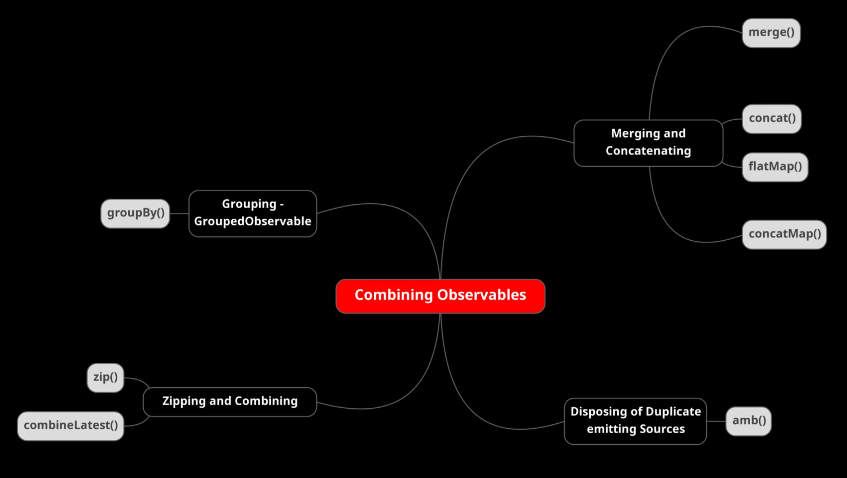
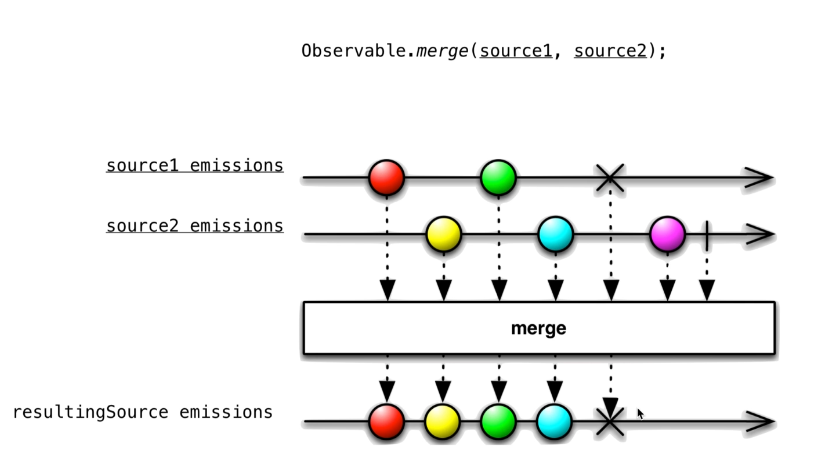
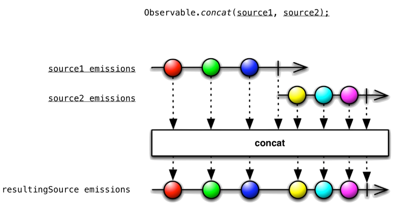
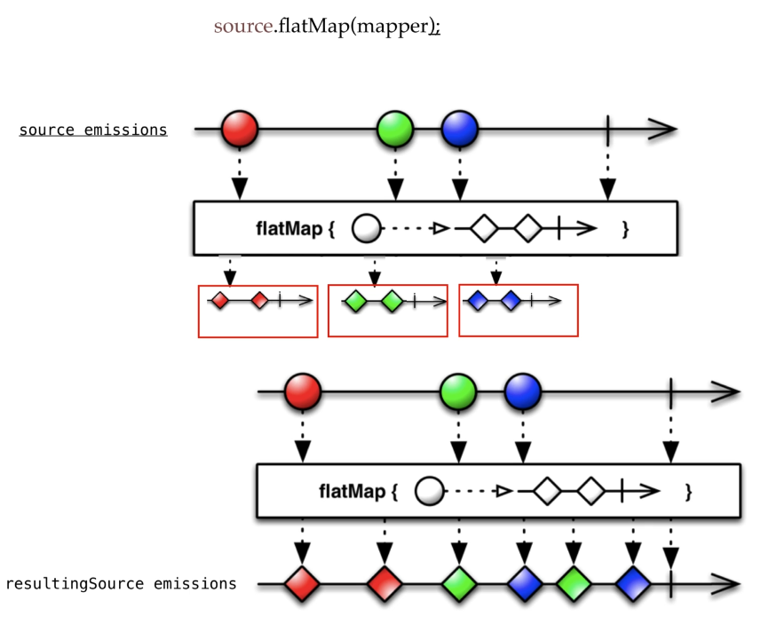
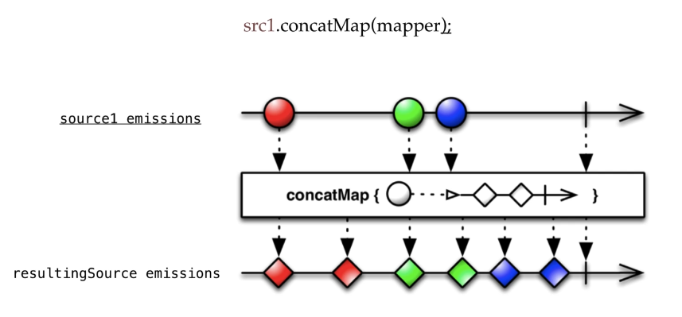
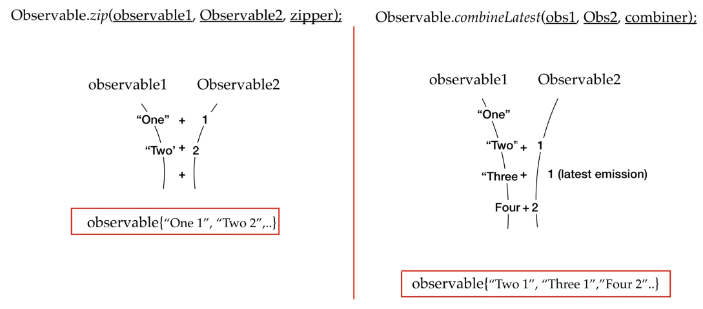
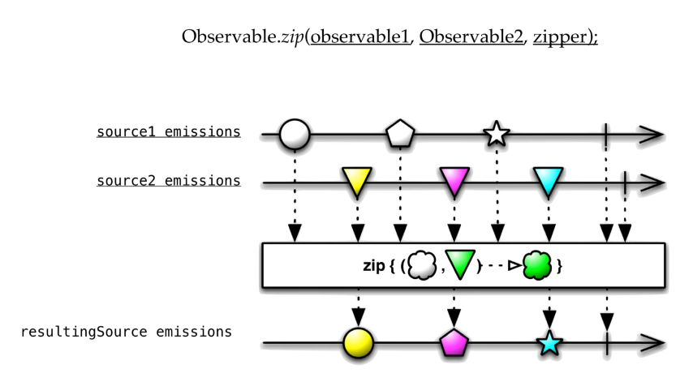
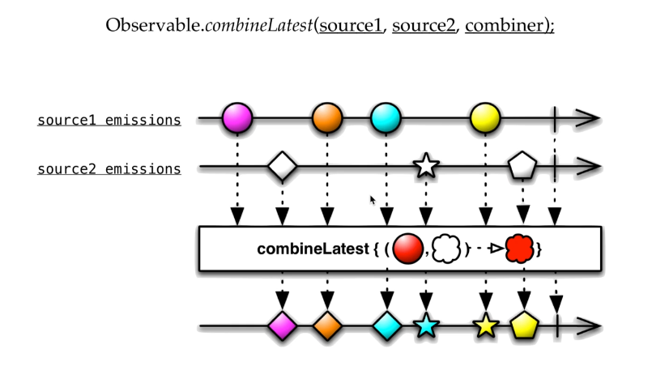
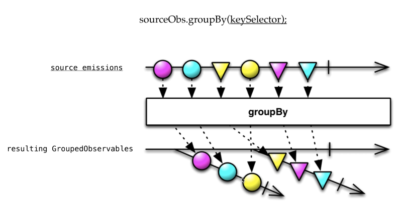

## RxJava | Combining Observables
Imagine an environment where you are having a lot of microservices running on different machines, and you want to club responses from those services and show result on UI.  
In these kind of scenarios these operators are very helpful.  
There are various operators and factories for this like "concat", "merge", "zip", "amb" and many more.  

### Merging and Concatenating
We have "merge" method for merging and "concat" for concatenating multiple observables and obviously that's not the only difference.  
All combining operators are about merging the emissions of multiple observables to have a single observable source, but what kind of emissions this resulting observable will emit, it depends on what operator we are using to merge them.  
**NOTE:** Using source that emit data from the same thread for example using "just(...)" factory method, both method produce the same result. Merge will produce a result equals to what we expected from concat.  
Unlike if we use sources that works on separated thread for example using "interval(...)" factory method, the "merge" method works as we expect, but the "contact" method since it need to work sequentially, will never emit the second source until the first one ends. So in case like "interval" we need to limit (using the "take()" method) the first source.

The "Observable" interface offer some factory method for "merge" and "concat", but we can also do the same using the "mergeWith" and "concatWith" methods provided by the Observable instance created via one of Observable creation factory method.

    // Via Factory Method
    Observable.merge(s1, s2)

    // Via Observable Reference
    Observable<String> s1 = Observable.just(...);
    Observable<String> s2 = Observable.just(...);
    s1.mergeWith(s2);

- **merge(Observable o1, Observable o2)** merge takes two observables but that's not the only signature we have.  
  
  If an error occur (the X in the marble diagram) no further emission will be emitted.

- **concat(Observable o1, Observable o2)** unlike the merge, concat maintains the sequential order so you will get the emissions in order you have passed the observables to the concat method.
  
  Also for concat we have multiple overloads method and in case of error the emission ends.

### FlatMap vs ConcatMap
Like we saw for merge and concat also this two methods used to merge and concat.
*Remember: merge returns observable that performs the emissions in interleaved fashion whereas concat returns an observable that performs emissions in sequential fashion.*  
But these **"flatMap" and "concatMap" operations are a lot different from merge and concat methods.**  
Basically their application is entirely different.
See "FlatMapAndConcatMap" java example in "courses.basics_strong.reactive.section20" package. 

As we already said for merge and concat, to see the difference between fltMap and concatMap we need use a mapper that works on separated thread to see merge working on interleaved manner.

Both methods have many overloads methods.

- **flatMap(...)** merges the observables.  
  It takes each emission or each element and then break it up into multiple elements and returns an observable having those elements and finally when we get all the observables corresponding to each element the merging happens.
  Flatmap takes all these observables returned by each element and flatten them or merge them to have a single observable having all the emissions of those created observables.  
  

- **concatMap(...)** concatenates the observables.  
  Is just like "flatMap" only difference is that the final merging between the observables will be in sequential fashion
  

### Disposing of duplicated emitting source: the "amb()" method
When we have multiple sources that are emitting the same data, we can use this operator to reduce the execution time by only considering the faster source.  

See "AmpDemo" java example in "courses.basics_strong.reactive.section20" package.

### Zip vs CombineLatest
In case of "zip" each corresponding value is combined according to the given lambda to result to a new emission in the resulting observable.  
In case of "combinedLatest" the emissions which are latest are combined to result to a new emission in the resulting observable.  

- **zip(...)** we have many signatures for "zip" method.  
  It takes observables that we are going to zip and a zipper function. It can take from two to nine observables so it has so many overloads and a zipper function.  
  Zipping allows you to take an emission from each observable source and combine them or combine these different emitted types into a single emission.  
  You provide the lambda to decide how the corresponding emissions should get combined.  
  Basically the zip method returns an observable that applies a function of your choice to combine the items emitted.  
  

- **combineLatest(...)**  we have many signatures for "combineLatest" method.
  It is quite identical to "zip", it combines emissions in one to one pairing just like "zip" the difference is one resource emission never waits for other resource to emit new mission it just pairs with the latest emission from the resource.  
  

See "ZipAndCombineLatest" java example in "courses.basics_strong.reactive.section20" package.

### Grouping and Grouped Observables
Is used to group emissions by some specific key into separate observables. In order to do this, we have operator "groupBby".  
It takes a lambda to map emission to a certain key.  
It takes emissions  and group them as per our key selector that we pass it, and then it emits the grouped items as grouped observables.  
The observable returned by "groupBy" consists of two "GroupedObservable" formed from these emissions according to the key selector.  
What is a "GroupedObservable"? Is a type of observable that emits an emission mapped to some specific key.  

See "Combining" java example in "courses.basics_strong.reactive.section20" package.