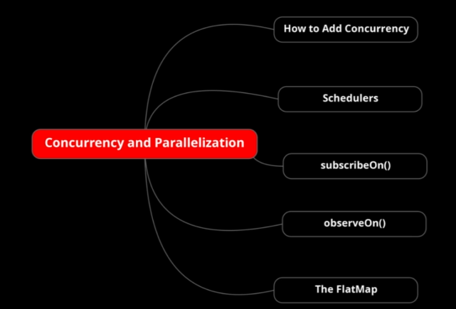
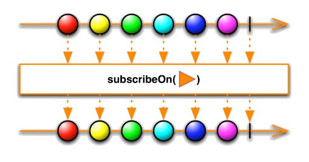

## RxJava | Concurrency and Parallelization  

### How to?
Till now, we saw observables observers subjects and almost every important component in RxJava running on a single main thread.  
But you must be feeling like where is the main essence of using RxJava it is in making the code async.  
You all know how powerful parallel processing is, you can run tasks or subtasks in parallel rather than going serially and waiting for one task to complete to run the next task.  
But RxJava observable has a contract:

    // RxJava Observable Contract
    From observable, the emissions must be passed sequentially and one at a time.
    Emissions cannot be passed by an observable concurrently or in parallel.  

**If this is a contract then how we can make the task run a sync in an RxJava program?**  
Look the "ConcurrencyInRxJava" example that contains details about this theme and placed on "courses.basics_strong.reactive.section21" package.

### Schedulers
We talked about observable contract.  
**If you do concurrent programming by yourself, you have to make sure that you do not breach the observable contract.**  
It will defeat the whole purpose of using observable and observer relationship at the first place and if you are doing parallel programming by yourself you also have to put your mind to decide on the number of threads for each different type of task you are going to perform.  
**So you will simply want to use RxJava Schedulers.**  
There are different kind of Schedulers for different kind of tasks:  
1. **Computation Scheduler** It is for computation intensive tasks (where a lot of calculation is happening such as: algorithms, math, complex logic).  
   We can get its instance by calling "Schedulers.computation()".  
   This kind of scheduler **maintain a fixed number of threads equal to number of cpus or cores available to your java session.**  
   No benefit in having more worker threads than available cores to perform such work.  
   If you unsure which scheduler is the right one to use prefer computation one by default.  
   **Take care about the number of threads is less or equals to the number of your CPUs** using "Runtime.getRuntime().availableProcessors()" to determinate it.  
   See "ComputationScheduler" on "courses.basics_strong.reactive.section21.schedulers" package.

2. **I/O Scheduler** It is for I/O intensive operation tasks (when we have a lot of: file, database or networking operations like http calls).  
   We can get its instance by calling "Schedulers.io()".  
   Is this such of case where threads are free half the time because they wait for the data to be sent or come back **in that case threads may be greater than the number of cores.**  
   I/O Scheduler will maintain as many threads as there are tasks and will dynamically grow cache and reduce the number of threads as needed.  
   See "IOScheduler" on "courses.basics_strong.reactive.section21.schedulers" package.

3. **NewThread Scheduler** It is different from the schedulers we have met upon because both create a pool of threads and reuses the threads.  
   This is not the case with "newThread" because it does not create a pool of threads. To be reused it just create one thread per observer and after completing its job it gets terminated.   
   This is helpful when you want to create use and then destroy a thread immediately so that it does not take up memory.  
   We can get its instance by calling "Schedulers.newThread()" that **will create a new thread for each observer and then destroy the thread when it is done**.  
   See "NewThreadScheduler" on "courses.basics_strong.reactive.section21.schedulers" package.

4. **Single Scheduler** It is used when you want to run tasks sequentially on a single thread.  
   **It is helpful for performing non-thread safe operations to a single thread.**  
   In this case one thread is responsible to perform all the tasks by all the observers sequentially.  
   We can get its instance by calling "Schedulers.single()".  
   See "SingleScheduler" on "courses.basics_strong.reactive.section21.schedulers" package.

5. **Custom Scheduler**  
   **NOTE: USING JAVA'S EXECUTOR-SERVICE THE THREAD IS NOT A DAEMON.**  
   Using "Single", "NewThread", "I/O" or "Computation", the schedulers will be provided by RxJava and these are daemon in nature and terminates when the "main" terminates or when we dispose the obtained Disposable during the subscription. **This not happens when we use this kind of scheduler.**  
   **NOTE:** Since the Executor-Service is not a demon you'll look on the example "CustomScheduler" we will not need to use the thread sleep function to see to pause the main in order to see the outputs. When all tasks will be terminated the "doFinally(...)" method will be invoked and executor service will be shut-down as so the program terminated.
   **NOTE: after the "from(executorService)" is important use the method "doFinally(...)" in order to finalize the executor service**. Take a look to the example below.

         // Executor Service declaration
         // For example we declare a fixed thread pool with a certain number of threads
         ExecutorService executor = Executors.newFixedThreadPool(numThread);

         // Now we are going to create an Observable on our custom tasks
         Observable<CustomTask> source = Observable.just(
                        create("First Custom Task"), create("Second Custom Task"),
                        create("Third Custom Task"), create("Fourth Custom Task"))
                // we want to use a Scheduler from an Executor Service when will subscribe on this Observable
                .subscribeOn(Schedulers.from(executor))
                // Now we want to ensure the executor-service terminates when the main ends or we want dispose.
                .doFinally(executor::shutdown);
 
   We can use to create a custom scheduler by passing a standard java executor service.
   We can get its instance by calling "Schedulers.from(executorService)".  
   See "CustomScheduler" on "courses.basics_strong.reactive.section21.schedulers" package.  

6. **Trampoline Scheduler** *you will not invoke it often as it is used primarily in RxJava's internal implementation.*  
   It is just like default scheduling on the immediate thread, but it prevents cases of recursive scheduling where a task schedules a task while on the same thread instead of causing a stack overflow error it will allow the current thread to finish and then execute the new scheduled task afterward.
   We can get its instance by calling "Schedulers.trampoline()".

### Subscribe On
As we saw on previous examples, during the creation of an Observable we can use "subscribeOn(...)" to let the Observer subscribe to observable on a particular thread.  
We know whenever we want to have the async behavior we just put the appropriate Scheduler in the "subscribeOn" method and the "subscribeOn" operator 
will suggest the source observable upstream and tell it to use scheduler and everything will work.
See this marble diagram it is just showing that "subscribeOn" asynchronously subscribe the observers to the current observable on the specified scheduler.

That's true but that's not at about "subscribeOn".  
There are two things about the position of "subscribeOn" operator in the observable chain:  

1. **Case when the POSITION of "subscribeOn(...)" DOES NOT MATTER**  
2. **Case when the POSITION of "subscribeOn(...)" MATTER** When there are more than one "subscribeOn(...)" or "observeOn(...)" calls.  

You can put "subscribeOn(...)" anywhere in the observable chain, and it anyway will suggest to the upstream all the way to the origin observable 
to the final observer, which thread to execute emissions with, but only when there are no more "subscribeOn(...)"  or no more "observeOn(...)" call in the chain.  
So if we have more than one "subscribeOn(...)" calls let's say with different schedulers the one which is closest to the source wins.  
If I call "subscribeOn( Schedulers.computation() )" and then I call "subscribeOn( Schedulers.newThread() )" the first one scheduler is that one that will be used.  
So prefer to call "subscribeOn( ... )" as close to source as possible so when there are more than one subscribe.  

See "SubscribeOnDemoPositionMatter" on "courses.basics_strong.reactive.section21" package.

### Observe On
We saw "subscribeOn(...)" is no help or might bother you if you want to change the scheduler in middle of observable chain.  
RxJava offer a solution to achieve this and is **"observeOn(...)"** operator.  
This operator intercepts the emission at the point where it is placed in the observable chain and switch them to a different scheduler going forward.  
So unlike "subscribeOn(...)" the placement of "observeOn(...)" matters.  
The upstream operators before "observeOn(...)" are not impacted but downstream will use the scheduler provided by "observeOn(...)".  
You can use "observeOn(...)" call in between the chain to switch onto different schedulers for the part of the chain which is having for example IO intensive operations and the rest with some other appropriate scheduler.  

**NOTE** it might seem perfect to you but *there are some performance implications* with "observeOn(...)". 
Generally what happens is when we have observable chain the elements emitted from the source are processed one after other
so one element go through the complete chain and then next comes and this goes on until there are elements to be emitted from the source.  
Now suppose if we introduce an observe on with a different scheduler in between this chain what happens is the operations above "observeOn(...)" 
execute on different scheduler and then the element reaches to this "observeOn(...)" call, and it emits the same element using different scheduler, 
and then it goes through the remaining chain that element goes through the right.  
Now the "observeOn(...)" does not wait for this element to complete this chain its work was only to change the scheduler so meanwhile the next element
reaches this "observeOn(...)" it again emits that element without waiting for the downstream to finish the current one.  
**This means that the upstream to the "observeOn(...)" can produce emissions faster than the downstream can process it.**  
This is called a producer consumer problem where the producer is producing emissions faster than the consumer is consuming the elements so if this happens 
the unprocessed emissions will be queued up in "observeOn(...)" until the downstream is able to process the elements, 
but if you have a lot of emissions you can potentially run into memory issues so in such scenarios we generally avoid creating observable.  
**In this scenario instead of creating observable we use "flowable" which supports back pressure.**

See "ObserveOnDemoPositionMatter" on "courses.basics_strong.reactive.section21" package.

### Achieving Concurrency using Flat Map