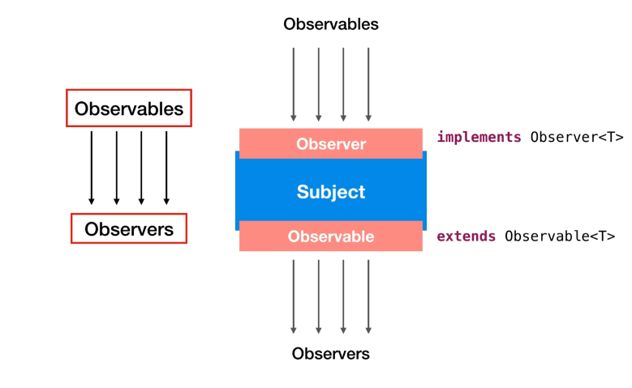

## RxJava | Subjects Replaying and Caching  

Multi-Casting is a way to reduce duplicated when you multicast an event you send the same event to all the downstream observers or subscribers.  
You don't retrieve the event again from the source. This is useful when you're doing an expensive operation like a network request.  
You don't want to repeatedly execute identical network requests for each observer or subscriber you just want to execute one and then multicast the results.  
So Subjects Replaying and Caching are the tools provided by RxJava to achieve Multi-Casting.

### Replaying and Caching
Both Replaying and Caching are a weird combination of hot and cold observable they does not re-emit but the emissions will be cached to be replayed.  

1. **"Replay"** is used to replay the emissions from the start for an observer coming late.  
   Basically we have replay method that returns a ConnectableObservable which shares a single subscription to the current observable that will replay all of its item and notification to any future observer.  
   
   So replay operator is a powerful way to hold on to previous emissions within a certain scope and re-emit them when a new observer comes in.  
   Using "replay" method to an Observable we will obtain a ConnectableObservable so this means the firing event emission stars from the "connect" method invocation. We can also use "autoConnect" method to automatically starts the connection and emitting.  

    **Replay Caching** is the capability of the "reply" method to limit the replaying of emission only to a certain number of latest emissions.
   The "reply" method offer many signatures in order to play with caching behaviour.
   - Simplest one is specifying the buffer size.
   - Or we could prefer specify the period before emissions must live before their eviction.
   - Or we can use both period and buffer size
   - Or specify a function as selector (this is quite different as behaviour).
   - A combination of selector, buffer and period and so on... 

   See both "Replaying" and "ReplayingAndXXX" examples on "courses.basics_strong.reactive.section22" package.

2. **Caching** is very similar to "replay" but "cache" operator return an Observable, and we don't need to use "autoConnect" or "connect" methods.  
   The caching stars automatically when we subscribe to an Observable.  
   Another different is unlike "reply" method, "cache" doesn't offer overloads.

### Subjects
Quick recap: Observables emits data and Observers listen those emissions.  
**Subject is a kind of bridge or proxy that can act as both an observer and an observable.**  
It can observe data items **from multiple sources and can emit data to multiple observers** as it implements both object variable and observers simultaneously.  
So this makes Subjects suitable for both output and input.  
**Subjects can multicast too**, all the subscribed observers will receive the same emissions from the point where they have subscribed.  

Two point about the Subjects:
1. they multicast they are hot
2. they can be used to merge the emissions from multiple sources

You can have any number of observables and observers simultaneously and the subject can help us process all the connections simultaneously.  
But **keep in mind** that while doing this you're not increasing the complexity unnecessarily.  

NOTE: Linking observables to observers or vice versa using Subject you can also input your own emissions in between but this also shows how dangerous it can be.  
Suppose someone invoke "onComplete", every subscription will not get emission anymore or someone invoke "onNext" arbitrary getting unwanted and crap emissions.  
You should prevent someone can use the Subject enclosing it.  
Also there's no way to dispose them as they are disposable.  
Therefore it is always preferred: 
- to keep data driven sources cold 
- or if we want them to be hot we should multicast them using the publish or replay methods
- or we may cast it to observable itself
- or wrap inside a class implementing on next on error on complete internally to control the sequence
- or just don't expose it

Another thing to note here is that **Subjects are not thread safe.**  
If multiple threads are calling "onNext", "onComplete", "onError" or "onSubscribe" then emissions may start to overlap and that's not acceptable as emissions must happen sequentially.  
So for this however we have "toSerialized" method that we can invoke on the Subject to create a safe serialized subject implementation that will make sequential all the event calls.

      // Serialize Subjects
      Subject<Object> serializedSubject = PublishSubject.create()
                                             .toSerialized();

See both "Subjects" and "SubjectsAsync" examples on "courses.basics_strong.reactive.section22" package.
   
### Adding Emissions using Subjects
Subject exposes three well known methods:
- "onNext"
- "onError"
- "onComplete"

Remember the Subjects are "Hot" so this means if we invoke "onNext" before the Subject subscription will never see the result. **We must do it after the Subject subscription.**  
Note: Invoking the "onComplete" we are saying the emissions ends. So if we invoke again the "onNext" method after the "onComplete" nothing will happen.

### Subject Implementations
Subjects are many different type of implementations:
- **PublishSubject**: we have already met it.  
  This is the most basic form of subject.  
  Starts to emit the source observable items from the moment observer subscribe to it.  
  See the "SubjectTypePublishSubject" on "courses.basics_strong.reactive.section22" package.  
  For example consider a use case,
  that's the case where published subject can be used to observe or consume data from the point of time when you tune to that channel.
  
  - Suppose television is an observable.
  - You are observer that observes some random thing on it, for example a movie.
  - You'll start watching movie after tuning into that particular channel.
  - You can get the previously transmitted data from it.

- **ReplaySubject**: this subject type emits all the items of the source observable regardless of when the subscriber subscribes.  
  That means it replace emissions for every subscriber. It is internally just a PublishSubject with a cache operator.  
  See the "SubjectTypeReplaySubject" on "courses.basics_strong.reactive.section22" package.  
  A use case is:
  
    - You're watching something on YouTube
    - And then someone joins you
    - If he wants to watch it from the beginning you may start it again

- **BehaviorSubject**: its implementations is used to emit the most recent item with the subsequent items of the source observable from the point of subscription.
  See the "SubjectTypeBehaviorSubject" on "courses.basics_strong.reactive.section22" package.  
  A use case is:
  
    - If you start watching something on Internet
    - And your friend joins you and wants to watch it from the most recent thing not from beginning
    - So that he gets idea about the context
    - Instead of using "replay" we use BehaviorSubject in such case

- **AsyncSubject**: this subject emits only the last value of the source observable after the source completes that is after invoking the "onComplete" action.  
  See the "SubjectTypeAsyncSubject" on "courses.basics_strong.reactive.section22" package.  
  One point to remember about AsyncSubject is that it will only emit the emissions when "onComplete" is called.  
  **We shouldn't use this with infinite observables!!!**   
  A use case is:
  
    - When neither you nor your friend are interested in watching the complete episode of some season
    - Just want to come to know about the end that's where we use "AsyncSubject" 

- **UnicastSubject**: this one just like any other subject can subscribe to sources, **but it buffers all the emissions received by the sources until an observer subscribes to it.**  
  When an observer subscribes to it, it releases all the buffered emissions to the observer and clears its cache.  
  And since it buffers emissions and emits emissions to the observer subscribing it just **allows one observer** because once the emissions get emitted to one observer they cannot be re-emitted to other one.  
  **LOOK**: If we try to use it in one of our previous example we will obtain an Exception because with UnicastSubject we can use only one subscriber.  
  See the "SubjectTypeUnicastSubject" on "courses.basics_strong.reactive.section22" package.