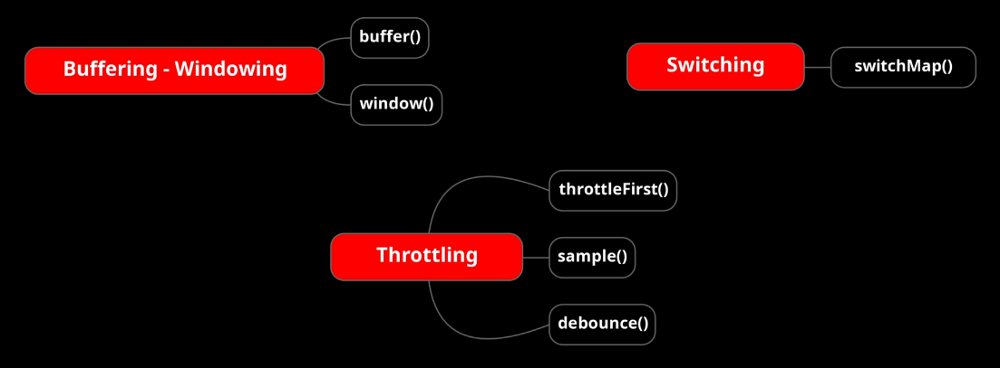
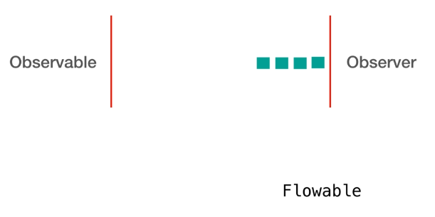

## RxJava | Buffering Throttling and Switching
Are used to batch up emissions into data chunks or emit in particular time slice.  

### Buffer and Window
We saw how RxJava simplified concurrent and async tasks.  
Now while introducing concurrency and using Schedulers with Observables sometimes there might be a situation where Observables emit faster than an Observer can consume.  
Such type of situation can be handled by using "flowable" instead of "observables".  
**Flowables** are actually observables with the property called **back pressure**.  

But some events cannot be handled with it, for example user input events we can control the user itself with program to slow down his inputs.  
In these cases RxJava provides some operators to batch up emissions into data chunks or image in particular time slice so the consumer can consume more easily.  
1. **"Buffer":** is used to:
   1. First gather emissions in specified scope.
   2. Emit each batch or group as a collection type instead of emitting one item at a time  
   
   There are many ways to define scope though for example specifying fixed size to batch emissions.  
   The "buffer(...)" operator has some overloads:
   1. "buffer(int bufferSize)" simply specify the buffer size. It returns an "Observable<List<T>>".
   2. "buffer(int bufferSize, int skip)" like the previous one but permit to skip data. Skip means  how many items emitted by the current Observable should be skipped before starting a new buffer. It returns an "Observable<List<T>>".
   3. "buffer(int bufferSize, Supplier<U> sup)" specify the buffer size and permit to specify the accumulator type used to buffer data. For example, we would use an HashSet instead of the default List. It returns an "Observable<U>".
   4. "buffer(long timeSpan, TimeUnit unit)" span data grouped by time. It returns an "Observable<List<T>>".
   5. "buffer(Observable boundaryIndicator)" the emitting of the boundary observable causes the returned ObservableSource to emit the latest buffer and complete. 

   There are a lot of method overloads...

2. **"Window"**

3. **"Throttle First" and "Throttle Last"**

4. **"Switch Map"**

### Throttle Operator

### Switch Map