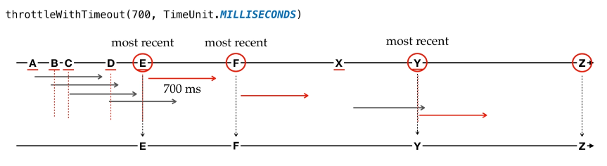

## RxJava | Buffering Throttling and Switching
Are used to batch up emissions into data chunks or emit in particular time slice.  

### Buffer and Window
We saw how RxJava simplified concurrent and async tasks.  
Now while introducing concurrency and using Schedulers with Observables sometimes there might be a situation where Observables emit faster than an Observer can consume.  
Such type of situation can be handled by using "flowable" instead of "observables".  
**Flowables** are actually observables with the property called **back pressure**.  

But some events cannot be handled with it, for example user input events we can control the user itself with program to slow down his inputs.  
In these cases RxJava provides some operators to batch up emissions into data chunks or image in particular time slice so the consumer can consume more easily.  
1. **"Buffer":** is used to:
   1. First gather emissions in specified scope.
   2. Emit each batch or group as a collection type instead of emitting one item at a time  
   
   There are many ways to define scope though. For example specifying fixed size to batch emissions.  
   The "buffer(...)" operator has some overloads:
   1. "buffer(int count)" simply specify the buffer size. It returns an "Observable<List<T>>".
   2. "buffer(int count, int skip)" like the previous one but permit to skip data. Skip means  how many items emitted by the current Observable should be skipped before starting a new buffer. It returns an "Observable<List< T >>".
   3. "buffer(Supplier< U > sup)" permit to specify the accumulator type used to buffer data. For example, we would use an HashSet instead of the default List. It returns an "Observable< U >".
   4. "buffer(long timeSpan, TimeUnit unit)" span data grouped by time. It returns an "Observable<List<T>>".
   5. "buffer(ObservableSource boundaryIndicator)" the emitting of the boundary observable causes the returned ObservableSource to emit the latest buffer and complete. 

   There are a lot of method overloads...  
   See "Buffering" example on "courses.basics_strong.reactive.section23" package.

2. **"Window"** this operator is somehow similar to buffer.  
   Difference is:
   1. It buffers into other observables rather than collections.
   2. It yields an observable of observables. In this manner it is much like grouped observables.
   3. Every observable will cache their emissions for specified scope and then flush once subscribed.
   4. Hence instead of waiting for each list or collection to be emitted with this approach we get emissions immediately as soon they become available.
   5. Since a lot of its methods returns an "Observable<Observable<T>>" you'll need to flat in order to transform on a Single or a List. 

   There are many ways to define scope though. For example specifying fixed size to batch emissions.
   The "buffer(...)" operator has some overloads:
   1. "window(int count)" simply specify the window buffer size. It returns an "Observable<Observable<T>>".
   2. "window(int count, int skip)" like the previous one but permit to skip data. Skip means  how many items emitted by the current Observable should be skipped before starting a new buffer. It returns an "Observable<Observable< T >>".
   3. "window(long timeSpan, TimeUnit unit)" span data grouped by time. It returns an "Observable<Observable<T>>".
   4. "window(ObservableSource boundaryIndicator)" the emitting of the boundary observable causes the returned ObservableSource to emit the latest buffer and complete.

   There are a lot of method overloads...  
   See "Window" example on "courses.basics_strong.reactive.section23" package.

### Throttle Operator
Throttling exclude or skip some of the emissions when they occur rapidly.  
This is useful when some of those rapid emissions are unwanted or redundant.  
For example when user clicks on a button repeatedly the inputs are redundant in such cases we can use throttle operators.  
In this category we have:
1. "Throttle First":  
   Emits only the first item emitted by the current Observable during sequential time windows of a specified duration.  
   This differs from "throttleLast(...)" in that this only tracks passage of time whereas "throttleLast(...)" ticks at scheduled intervals.  
   When we use "throttleFirst(...)" the sequence of emissions would be something like what represented in below picture.
   - So first we are having "A" first emission
   - "A" is the first one in this duration so we get "A" and then
   - after one second the first element to be emitted is "E" and then again
   - after one second the next first element is "X" and again
   - after one second we have "Z"

   

2. "Throttle Last":  
   Like "throttleFirst(...)" but in this case we will obtain the last element emitted during the interval duration.  
   NOTE: "throttleLast(...)" is an alias of "sample(....)"
   When we use "throttleLast(...)" the sequence of emissions would be something like what represented in below picture.
   - So first we are having "D" first emission
   - "D" in the last one in this duration so we get "D" and then
   - after one second the last element to be emitted is "F" and then again
   - after one second the next last element is "X" and again
   - after one second the next last element is "Y"

   

3. "Throttle With Timeout":  
   The behavior of this operator is a bit different: instead of emitting items after fixed intervals this emits items after particular period of inactivity of the source.  
   It checks if the source is not emitting anything for the time we specify as argument then it will emit the next occurring element from the source and at every mission the timer gets reset.  
   In other words if this operator keeps track of most recent emitted item and emits that item only when enough time has passed without source emitting anything.  
   NOTE: "throttleWithTimeout(...)" is an alias of "debounce(....)"  
   When we use "throttleWithTimeout(...)" the sequence of emissions would be something like what represented in below picture.
   - "A" most recent item then it checks for the period of silence that's 700 milliseconds on our example
   - But then 200 milliseconds after we get "B" so timer gets reset, and again it checks for 700 milliseconds
   - In 100 milliseconds again "C" gets emitted
   - Again timer gets reset and in again 400 milliseconds "D" gets emitted
   - then "E" gets emitted and it is the most recent item
   - now it starts looking for the period of silence again from "E" emission finally find that source is not emitting anything 700 millisecond so it emits the most recent item which is "E" and continue.

     
   This is very effective way to handle redundant events or excessive inputs but one disadvantage of this method is that it delays emission by specific time interval and sometimes that's not acceptable from user point of view.  
   For such cases where we can't go with dealing even the winning emission we can use "switchMap(...)".

There are a lot of method overloads...  
See "ThrottlingXXXX" examples on "courses.basics_strong.reactive.section23" package.

### Switch Map