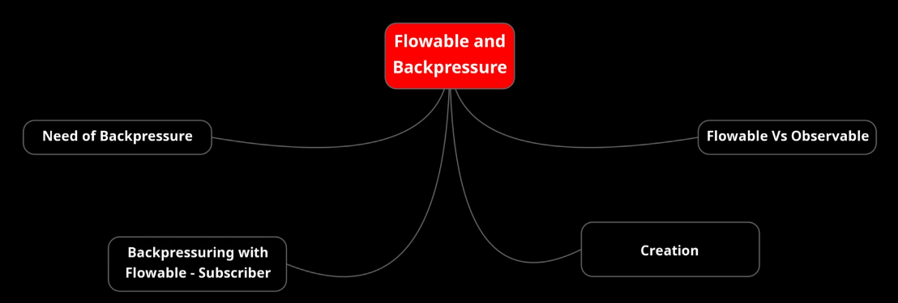
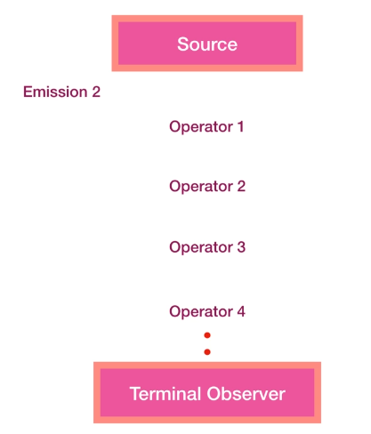
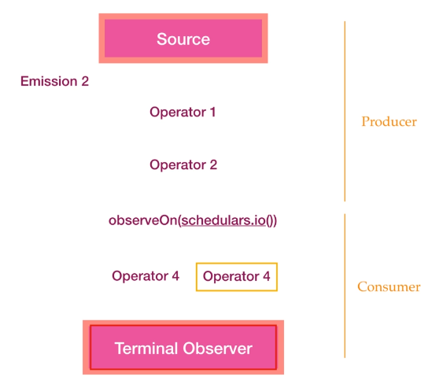

## RxJava | Flowable and BackPressure

### Producer/Consumer problem: Need of BackPressure
Why there is a need for having something that can provide solution to BackPressure?  
What is back pressure?  
We all know the general flow of emissions in the observable chain. The observable emits the item and then the item travels through the complete chain and after that next comes right, so this is the normal flow.  
  
But when we add concurrency or parallelization in this chain then  multiple parts of this chain are operated on different threads.  
For example if we put an observe on call in between this chain it will be like the upper part of this chain is processed by some thread and the lower part is processed by some other thread.  
Now an emission is no longer strictly being handed downstream one at a time from the source all the way to the observer before starting the next one.  
This is because once an emission hits a different scheduler through "observeOn(...)".  
The source is no longer in charge of pushing that emission to the observer.  
Therefore the source starts pushing the next emission, even though the previous emission may not have reached the observer yet.  
So this way producer may produce faster than the consumer can consume.  

  

See "ProducerConsumerProblem" example on "courses.basics_strong.reactive.section24" package.

### BackPressure with Flowable/Subscriber

### Creation and BackPressure strategies

### Flowable vs Observable