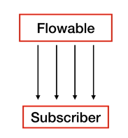
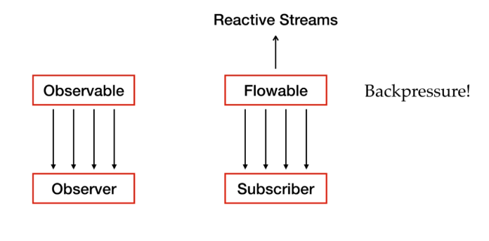
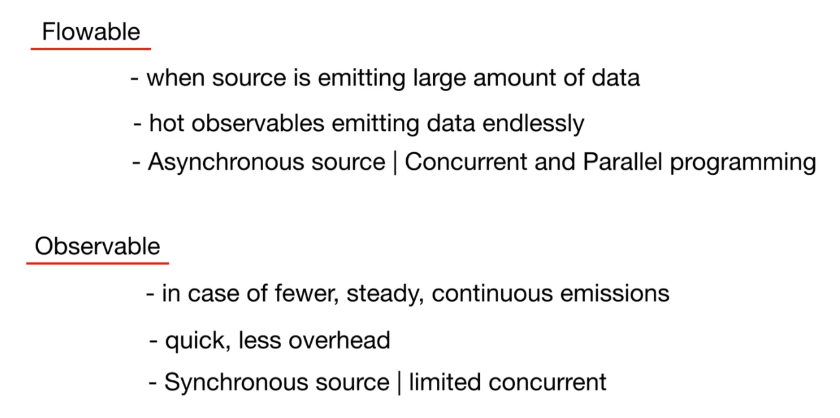
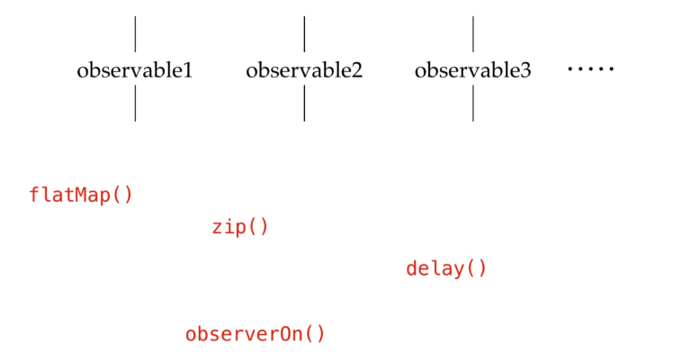
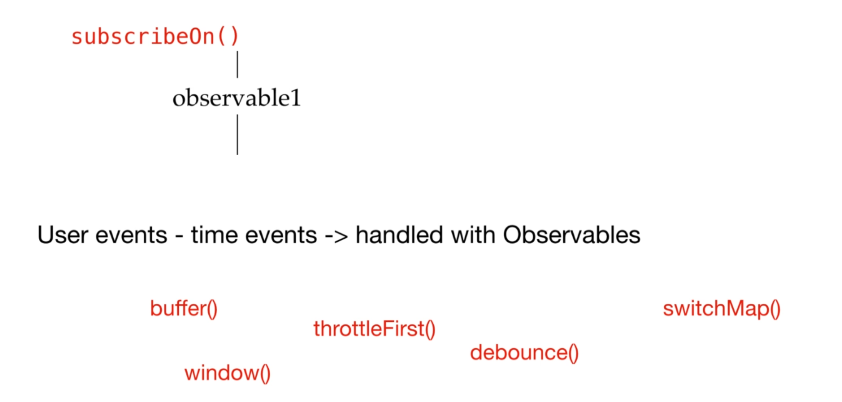
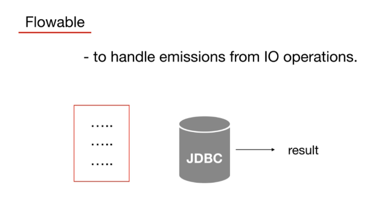

## RxJava | Flowable and BackPressure

### Producer/Consumer problem: Need of BackPressure
Why there is a need for having something that can provide solution to BackPressure?  
What is back pressure?  
We all know the general flow of emissions in the observable chain. The observable emits the item and then the item travels through the complete chain and after that next comes right, so this is the normal flow.  
  
But when we add concurrency or parallelization in this chain then  multiple parts of this chain are operated on different threads.  
For example if we put an observe on call in between this chain it will be like the upper part of this chain is processed by some thread and the lower part is processed by some other thread.  
Now an emission is no longer strictly being handed downstream one at a time from the source all the way to the observer before starting the next one.  
This is because once an emission hits a different scheduler through "observeOn(...)".  
The source is no longer in charge of pushing that emission to the observer.  
Therefore the source starts pushing the next emission, even though the previous emission may not have reached the observer yet.  
So this way producer may produce faster than the consumer can consume.  

  

See "ProducerConsumerProblem" example on "courses.basics_strong.reactive.section24" package.

### BackPressure with Flowable/Subscriber
As we have Observable that emits to an Observer we also have **Flowable and Subscriber.**  
Flowable emits and the Subscriber listen to those emissions.  
We talked about the Producer/Consumer problem and need of BackPressure, but how we can apply it in the chain?  

So Flowable is the replacement of Observable where we need BackPressure.  
See "BackPressure" example on "courses.basics_strong.reactive.section24" package.  
See "BackPressureWithLimits" example on "courses.basics_strong.reactive.section24" package.

### Flowable Creation and BackPressure strategies
As we already said pretty much all the Observable factories and operators apply to Flowable.  
*They are same but still there is one critical difference between "Observable.create(...)" and "Flowable.create(...)":* with Flowable you must specify a back pressure strategy as a second argument.  
There are different kind of  Buffer Strategies:  
1. **BUFFER**: buffer queues up emissions in an unbounded queue.  
   Until then the downstream is able to consume them. Once the downstream is ready it flushes the buffer, but it can cause an out of memory error if the queues gets too large.
2. **DROP**: Drop if the downstream cannot keep up this will ignore the upstream emissions, and will not queue anything while the downstream is busy.
3. **ERROR**: Error signals are missing back pressure exception the moment the downstream cannot keep up with the source.
4. **LATEST**: This will keep only the latest emission until the downstream is ready to receive it.
5. **MISSING**: It results in no back pressure implementation at all.  
   The downstream must deal with the back pressure overflow.  

See "FlowableCreation" example on "courses.basics_strong.reactive.section24" package.

### Flowable vs Observable
Observable and Flowable both are the entities that can be observed by observer or subscriber right.  
**But Flowable:**
1. it is an implementation of reactive stream
2. it is different from Observable
3. it supports BackPressure

**We should use Flowables when:**
1. we are expecting emissions in large amount of data and need to perform complex operations on them
2. when we have HotObservables that continuously emit data even if consumer can't consume them.
3. when we have asynchronous sources.  
   when we are going to do concurrent or parallel programming like performing operations on different threads like combining different observables on different threads or using observeOn delay such operators.  
   

**We should use Observables when:**
1. when we have fewer emissions and if they are steady and continuous or when events are emitting lazily
2. it will completely work fine as it's quicker and also has less overhead than Flowable
3. it is synchronous and has limited concurrency.  
   like using simply "subscribeOn" at the start of any observable chain.  
   then we may go with observable as it will process the complete chain on a single thread.
4. we should go with observables also while working with user events or time events as we can't handle them with flowables.  
   to handle them we may use operators like buffer window and operators for throttling switching

**Also, Flowables can be used when:**  
there are io operations in our observable chains because most of io operation support blocking while returning results.
iterating records line by line from the file or getting results set in the jdbc.
such cases are easy to handle with flowable as they can be paused and resumed easily

We can convert an Observable to a Flowable using the "toFlowable(BackPressureStrategy strategy)" operator.  
Obviously we can convert also a Flowable to an Observable using the "toObservable()" operator.

See "ConvertingToFlowable" and "ConvertingToObservable" examples on "courses.basics_strong.reactive.section24" package.